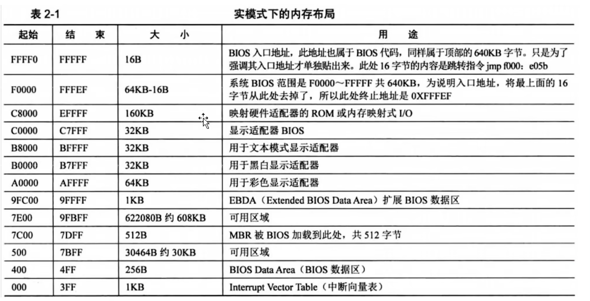

# 基础介绍及概念简介 


## 电脑启动过程 
上电->bios->MBR(boot)->loader-> kernel-> 交互界面 

> 为什么不能直接boot加载kernel，需要通过loader程序加载？ 
> boot 一般是 512 个字节， 大小有限，实现功能有限，所以需要通过先加载 loader 程序，然后再通过 loader 加载初始化内核的一些操作  


* bios(basic input output system): 基本输入输出系统， 主板自带程序， 具有检测主板硬件完整性的功能
* MBR(Master Boot Record): 主引导记录(磁盘第一个扇面，第一个扇区) 
* 磁盘读写： 磁盘读写是按照扇区为基本单位的， 一般每个扇区有512个字节   


## 计算机组成原理 
> 冯诺依曼结构 
* 运算器+控制器 = CPU 
* 外部存储： 硬盘、软盘、光盘、磁带等 
* 存储器： 内存、显存、只读存储器 ROM 等 
* 输入设备： 键盘、鼠标、扫描仪、外部存储等 
* 输出设备： 显示器、音响、打印机、外部存储等 


## x86  
x 86 是一系列基于 Intel 8086 且向后兼容的中央处理器指令集架构  
> Intel 早起是以 80x86 这样的数字来命名处理器的， 包括 intel 8086、 80186 等，由于以 “86”作为结尾，因此架构被称为  “x86”    


## 内存地址方式方式 
 * 实模式：8086 
 * 保护模式： 32 位 80386   

> 默认说的都是实模式

 实模式内存地址 = 段地址 * 16 + 偏移量  


#### 在启动过程中的应用
* bios: 实模式 
* MBR(boot): 实模式 
* loader： 实模式 -> 保护模式 
* kernel 保护模式  

  

> 为什么在 32 位系统下，插入 大于 4G 的内存条时， 系统显示能用内存只有 3.x g ？ 
原因就在于，所有的内存地址，饼不是全部指向内存条的， 其中有部分内存地址是指向显存， bios 等其它硬件的地址的。 所以可用内存是小于理论可用内存的  


## 汇编  
汇编语法： `Intel语法` 和 `AT&T语法`  ， 一般使用的就是  `Intel语法`   

支持  `Intel语法`  汇编器 ： `MASM` 和 `NASM`  
* MASM: 来自 微软， 只能在 微软操作系统 window 和 MS-DOS上用。    
* NASM: 开源，支持多平台   

### nasm linux 使用  

```shell 
yum install nasm 
nasm boot.asm -o boot.bin -f bin 
hexdump boot.bin -C    
```


## MBR 
MBR(Master Boot Record， 主引导记录)：是磁盘上的第一个扇区， 又叫主引导扇区   
特点： 最后两个字节必须是 `0X55` 和 `0xaa`  


## QEMU + GDB 调试 
```shell
# 启动，停止在第一行
qemu-system-i386 d:\xxxx\GrapeOS.img -S -s
# 连接 gdb 
gdb 

# 连接 ip 目标机器
target remote 192.168.10.102:1234 

```