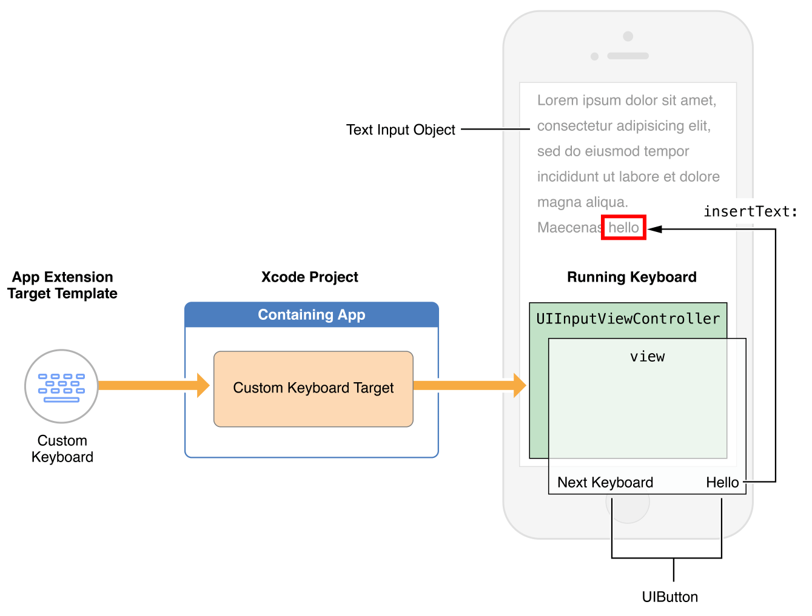

# iOS APP Extension - Custom KeyBoard 

用户选择自定义键盘后，它将成为用户打开的每个应用程序的键盘。因此，您创建的键盘必须至少提供某些基本功能。最重要的是，您的键盘必须允许用户切换到另一个键盘。


## 了解用户对键盘的期望 
要了解用户对自定义键盘的期望，请研究系统键盘 - 它快速、响应灵敏且功能强大。它永远不会用信息或请求打断用户。__如果您提供需要用户交互的功能，请将它们添加到包含键盘的应用程序中，而不是添加到键盘中。__  


### iOS 用户期望的键盘功能 
iOS 用户期望并且每个自定义键盘都必须提供 一项功能：__切换到另一个键盘的方法__  
在系统键盘中，这个功能是由一个地球按钮的按键提供的。在iOS8及以后，系统提供了抓们的API来完成这个功能。 
__[Providing a Way to Switch to Another Keyboard.](https://developer.apple.com/library/archive/documentation/General/Conceptual/ExtensibilityPG/CustomKeyboard.html#//apple_ref/doc/uid/TP40014214-CH16-SW4)  


系统键盘会基于当前文本输入对象的`UIKeyboardType`特性来呈现合适的键位和相应的布局。  
比如需要输入一个邮箱地址，系统键盘的句号按键就会改变：长按的时候能够提供多个顶级域名后缀选择。
> 设计你的自定义键盘的时候考虑一下这些特性。

iOS 用户还期望自动大写：在标准文本字段中，区分大小写的语言中句子的第一个字母会自动大写。  

更多这类功能如下： 
* 基于UIKeyboardType特性的键盘布局。
* 自动校正与建议
* 自动首字母大写 
* 两个空格后自动添加句号 
* 大写锁定支持
* 键帽美化
* 表意语言的多级输入


您可以决定是否实现此类功能；刚刚列出的任何功能都没有专用的 API，因此提供它们是一种竞争优势。  


### 一些系统键盘具备的功能不能在自定义键盘上实现  
* 您的自定义键盘无法访问“设置”应用程序（“设置”>“常规”>“键盘”）中的大多数常规键盘设置，例如自动大写和启用大写锁定。  
* 您的键盘也无法访问词典重置功能（设置 > 常规 > 重置 > 重置键盘词典）   
如要满足用户的灵活需求，请创建一个标准的设置选项，参考[Implementing an iOS Settings Bundle in Preferences and Settings Programming Guide](https://developer.apple.com/library/archive/documentation/Cocoa/Conceptual/UserDefaults/Introduction/Introduction.html#//apple_ref/doc/uid/10000059i)  
然后，您的自定义设置将显示在与您的键盘关联的“设置”的“键盘”区域中。  


有一些文本输入对象是自定义键盘没有权限进行输入访问的。首先是任何安全文本输入对象。这样的对象是通过其secureTextEntry属性被设置为来定义的YES，并且通过将键入的字符呈现为点来区分。

* 当用户在安全文本对象（比如密码框）输入时，系统会会临时的用系统键盘来替换你的自定义键盘。当用户在非安全输入对象输入的时候，你的自定义键盘就会恢复。  

* 自定义键盘同样不能用在拨号输入对象，比如通讯录中的号码输入框。这些输入对象专门用于由电信运营商指定的一组数字、字符，并由以下一个或者另外一个键盘类型来标示：
    * `UIKeyboardTypePhonePad` 
    * `UIKeyboardTypeNamePhonePad`

当用户点击电话键盘对象时，系统会暂时用适当的标准系统键盘替换您的键盘。当用户点击另一个通过其类型特征请求标准键盘的输入对象时，您的键盘会自动恢复。   


__应用程序开发人员可以选择拒绝在其应用程序中使用所有自定义键盘。__  
例如，银行应用程序的开发人员或必须符合美国 HIPAA 隐私规则的应用程序的开发人员可能会这样做。此类应用程序采用协议`application:shouldAllowExtensionPointIdentifier:`中的方法UIApplicationDelegate（返回值NO），因此始终使用系统键盘。 
```swift 
    func application(_ application: UIApplication, shouldAllowExtensionPointIdentifier extensionPointIdentifier: UIApplication.ExtensionPointIdentifier) -> Bool {
        return false
    }

```

由于自定义键盘只能在 UIInputViewController对象的主视图内部进行绘制显示，所以它不能选择文本。  
文本的选择是由使用键盘的应用程序控制的。如果App提供了编辑菜单（比如复制、剪切和粘贴），键盘是没有权限访问的。自定义键盘是不能提供光标位置附近的inline自动校正功能。  


在iOS8.0中自定义键盘和其他应用程序扩展一样，不能访问设备话筒，因此不能实现语音输入。  

最后，自定义键盘按键长按显示额外键位信息的视图是不能超过自定义键盘原始视图的顶部，系统键盘却可以。   


## 自定义键盘API入门  

这一节内容让你快速了构建自定义键盘的APIs。下图展示了一些关于键盘运行中的一些比较重要的对象以及在标准开发流程中的位置。  
 

`Custom Keyboard template`自定义键盘模板（__在iOS“Application Extension” target template group__）包含了一个 `UIInputViewController`的子类,这个子类作为你键盘的初始视图控制器。  

这个模板也包含了一个基本的按键实现“切换下一个键盘”，它调用了`UIInputViewController`的的 `advanceToNextInputMode`方法。  
将视图、控件和手势识别器等对象添加到输入视图控制器的主视图（在其 inputView 属性中）  

与其他应用扩展一样，`target`中没有`window`，因此本身也没有根视图控制器。

模板的info.plist文件中预先配置好了键盘的基本参数。查看在键盘target的info.plist文件下对应的`NSExtensionAttributeskey`键信息。
这些关于键盘配置信息的key请查看[Configuring the Info.plist file for a Custom Keyboard](https://developer.apple.com/library/archive/documentation/General/Conceptual/ExtensibilityPG/CustomKeyboard.html#//apple_ref/doc/uid/TP40014214-CH16-SW18)  


默认情况下，__键盘是没有网络访问权限的__，也不能和它的容器App共享同一个缓存空间。  
如果需要实现这些功能，请在info.plist文件中设置`RequestsOpenAccess = YES`。在这之后，会扩展键盘的沙盒。参考 [Designing for User Trust](https://developer.apple.com/library/archive/documentation/General/Conceptual/ExtensibilityPG/CustomKeyboard.html#//apple_ref/doc/uid/TP40014214-CH16-SW3)  


一个`input view controller`与`文本输入对象`内容的交互需要遵循多个协议:  
* 响应`touch events`的插入或者删除, 需要使用`UIKeyInput`协议方法`insertText:`和`deleteBackward`  
在输入视图控制器的`textDocumentProxy`属性上调用这些方法，该属性表示当前文本输入对象并符合协议`UITextDocumentProxy`.  
```swift 
[self.textDocumentProxy insertText:@"hello "]; // Inserts the string "hello " at the insertion point
[self.textDocumentProxy deleteBackward];       // Deletes the character to the left of the insertion point
[self.textDocumentProxy insertText:@"\n"];     // In a text view, inserts a newline character at the insertion point
```

* 当你调用`deleteBackward`这个方法时, 需要获取到当前的文本是否是你所需要的删除的, 通过`textDocumentProxy`属性的 `documentContextBeforeInput`属性可以拿到文本输入光标位置的文本内容。   
```swift 
NSString *precedingContext = self.textDocumentProxy.documentContextBeforeInput;
```
拿到文本内容之后，你就可以决定删除多少内容：比如单个字符、或者文本之后的全部空格。如果你想要删除整个的语义部分，例如一个单词、一个语句或者一个段落，参考 [CFStringTokenizer](https://developer.apple.com/documentation/corefoundation/cfstringtokenizer) 中描述的功能并参考相关文档。请注意，每种语言都有自己的标记化规则。

* 调用`UITextDocumentProxy`的协议方法`adjustTextPositionByCharacterOffset:`控制好光标插入位置，比如要删除更早之前输入的字符。 
```swift 
- (void) deleteForward {
    [self.textDocumentProxy adjustTextPositionByCharacterOffset: 1];
    [self.textDocumentProxy deleteBackward];
}

```

> 若要响应活动文本对象内容中的更改，或响应用户启动的插入点位置更改，请实现 UITextInputDelegate 协议的方法。  


通过`UIKeyboardType`属性，为当前文本输入对象展现合适的键盘布局。  为每种你所支持的特性，相应的对初始视图做出改变。  

要支持两种或者更多的语言，你有两个选择：  
1. 为每一种语言创建一个键盘，每个键盘单独的作为容器App的一个target。  
2. 创建一个多语言支持的键盘，根据需要动态的切换合适的语言。想要动态切换主语言，使用`UIInputViewController`类的`primaryLanguage`属性。  

> 使用哪种方式创建，取决于你支持的语言种类多少以及用户的实际体验。    


所有的自定义键盘都能通过UILexicon类来访问基本的自动校正词典(和`RequestsOpenAccess` 值没关系) 
请充分利用这个类以及你自己提供的自动校正词典来为用户输入文本提供建议和校正。     


`UILexicon`类的词汇来源包过： 
* 从用户地址簿获取的不成对的姓和名  
* 设置- 通用 - 键盘 - 自定义短语（Settings > General > Keyboard > Shortcuts list ）  
* 通用字典


可以 __使用自动布局来调整自定义键盘的主视图的高度__。__默认情况下，自定义键盘的尺寸大小是和系统键盘的大小一致__，都是根据屏幕尺寸和方向来决定。系统会把自定义键盘的宽度设置为当前屏幕的宽度。想调整键盘的高度，那就改变主视图的高度约束。

```objective-c  
CGFloat _expandedHeight = 500;
NSLayoutConstraint *_heightConstraint = 
    [NSLayoutConstraint constraintWithItem: self.view 
                                 attribute: NSLayoutAttributeHeight 
                                 relatedBy: NSLayoutRelationEqual 
                                    toItem: nil 
                                 attribute: NSLayoutAttributeNotAnAttribute 
                                multiplier: 0.0 
                                  constant: _expandedHeight];
[self.view addConstraint: _heightConstraint];

```

> 在iOS8.0之后当自定义键盘的主视图初始化之后，你可以在任意时候改变它的高度。   


## 自定义键盘开发的要点  
自定义键盘的时候需要注意： 
* `信任`: 你的自定义键盘能够让你访问用户的输入内容，所以信任是你和用户之间最重要的一点。
* `允许“切换下一个键盘”按钮 `:  让用户能够切换到下一个键盘是键盘的一个基本功能。你 __必须提供这个功能__。   


### 为用户信任而做设计  
创建一个自定义输入法优先考虑到的应该是如何建立和维持良好的用户信任，
这种信任处决于你对隐私政策理解的最佳做法并且知道如何去实现。

对于键盘，以下三个领域对于建立和维护用户信任尤为重要：  
* `键盘输入数据的安全性`: 用户希望他们通过键盘输入的数据写入文档或者文本输入框，而不是保存在某个服务器或者被用于用户不可知的地方。  
* `合理的并且最小化的使用用户数据`: 如果你的键盘使用了其他用户的数据比如定位服务、通讯录，那么你有责任需要向用户解释这样做给用户带来的好处。  
* `精准`: 输入事件转换为输入文本的准确性并不是用户隐私该做的，但是它对用户的信任产生影响：每一个文字的输入，都能让用户看到你代码的准确性。  


信任设计的过程中，首先要考虑的就是`open access`（完全访问权限）  
尽管对于自定键盘来说`open access`能够让你做到很多事情，这同时也意味着你要承担更多的责任。  
下表列出了标准和开启`open access`（开启网络访问）键盘对应的功能和隐私责任  

#### open access 
* 关闭(默认) 
    * 能力和限制 
        1. 自定义键盘拥有基本键盘的所有功能  
        2. 自定义键盘拥有基本键盘的所有功能 
        3. 访问settings中的短语列表 
        4. 与容器App没有共享缓存空间 
        5. 除了键盘自己的容器App以外没有文件访问权限 
        6. 除了键盘自己的容器App以外没有文件访问权限
    * 隐私注意事项 
        * 用户知道通过键盘输入的信息仅用于当前APP
* 开启  
    * 能力和限制 
        1. 拥有标准自定义键盘的所有功能  
        2. 用户允许的情况下访问定位服务和通讯录  
        3. 键盘和它的容器App拥有一个共享存储空间  
        4. 键盘能够发送键盘输入信息和其他输入时间给服务器端处理 
        5. 容器App能够为键盘的自定义自动校正词典提供编辑界面 
        6. 通过容器App，键盘能够使用iCloud来确保相关设置和自动校正词典能够更新到所有设备上  
        7. 通过容器App，键盘能够参与Game Center和App内购买  
        8. 如果键盘支持移动设备管理（DMD），那么键盘也能够与受控App协同工作
    * 隐私注意事项 
        * 如果键盘支持移动设备管理（DMD），那么键盘也能够与受控App协同工作  
        * 你必须遵守 `应用审核指南和iOS程序开发者协议中的联网键盘开发指导`，在App Review Support页面中可以找到。

如果你开发的键盘没有开启open access，那么系统就会确保在任何位置键盘的输入信息都不会被发送给你。如果你只是想提供一款基本功能的键盘，那么就使用标准自定义键盘。   
由于沙盒的限制，非联网功能的键盘能够让你在满足苹果的数据隐私准则和获取用户信任上取得领先。


如果你开启了完全访问（详情见[Configuring the Info.plist file for a Custom Keyboard](https://developer.apple.com/library/archive/documentation/General/Conceptual/ExtensibilityPG/CustomKeyboard.html#//apple_ref/doc/uid/TP40014214-CH16-SW18)），更多的功能对你开放同样也意味着更多的责任需要你承担。


> 提交一个`完全访问权限`的第三方键盘到`App Store`，你必须遵守 App Review Support页面的所有相关准则。  

作为开发者，每个与`open access`有关系的键盘功能都有相对应的你需要承担的责任。最大程度的去尊重用户数据，并且不要把这些数据用于用户所不知道的地方。  

> 开放访问键盘用户权益和开发人员责任 
TODO: 表格   


使用了`open access`的自定义键盘和它的容器App是能够将键盘输入数据发送到你的服务器，并且能让你使用自己的计算资源来实现诸如触摸事件处理和输入法预测等功能。如果你使用了这些功能，那么当你接收到的键盘、音频数据已经远超与你向用户提供的服务时你不应该存储这些数据。


### 提供切换到其他键盘的方式 
当有不止一个输入法可以使用的时候，系统键盘就会有一个小地球按键让用户切换输入法。你的自定义键盘也需要提供一个类似的切换按键。 
  

若要确定自定义键盘是否需要显示“下一个键盘”键，请检查输入视图控制器上的 `needsInputModeSwitchKey`` 属性。如果为 `true`，则键盘应包含此键。

若要要求系统切换到另一个键盘，请调用 `UIInputViewController` 类的 `advanceToNextInputMode` 方法。
系统从启用用户的键盘列表中选择相应的“下一个”键盘;没有用于获取已启用键盘列表或选择要切换到的特定键盘的 API。  

Xcode的自定义键盘模板以及包含了调用`advanceToNextInputMode`方法的按钮。不过为了更好的体验，你最好把这个按钮替换为类似系统小地球按钮的按键。   


## 开始自定义键盘的开发  
在本节中，你将了解如何创建自定义键盘，根据您的目标对其进行配置，以及如何在 iOS 模拟器或设备上运行它。您还将了解更换系统键盘时要记住的一些 UI 因素。  

### 使用 Xcode 自定键盘模板  
创建一个自定义键盘和它的容器App会与创建其他应用程序扩展少有不同。 这一节会一步步创建并运行一个键盘。  

#### 在容器App中创建自定义键盘  
1. `Xcode`中选择 `File>New>Project`,在`iOS Application template group`中选择`Single View Application template`。  
2. 点击下一步  
3. 为项目命名（例如，“包含键盘应用”），然后单击“下一步”。  
4. 选择你要保存工程的位置，然后点击创建  
    到此，你已经创建了一个空的app项目，现在需要包含一个键盘target。  
5. 选择`Flie>New>Target`在`iOSApplication Extension target template group`选择`Custom Keyboard template`，然后点击下一步。   
6. 创建⌨️名称  
7. 确保`Project`和`Embed in Application`弹出菜单显示的是容器App的名字，然后点击完成。如果弹出激活新键盘，点击激活。


