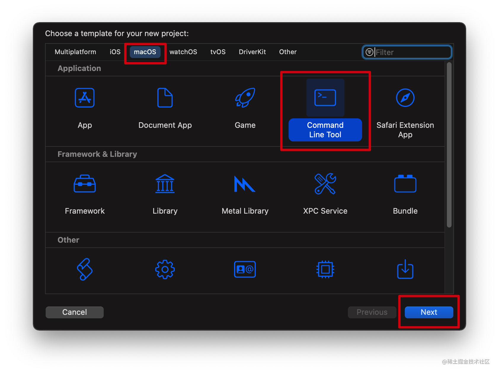
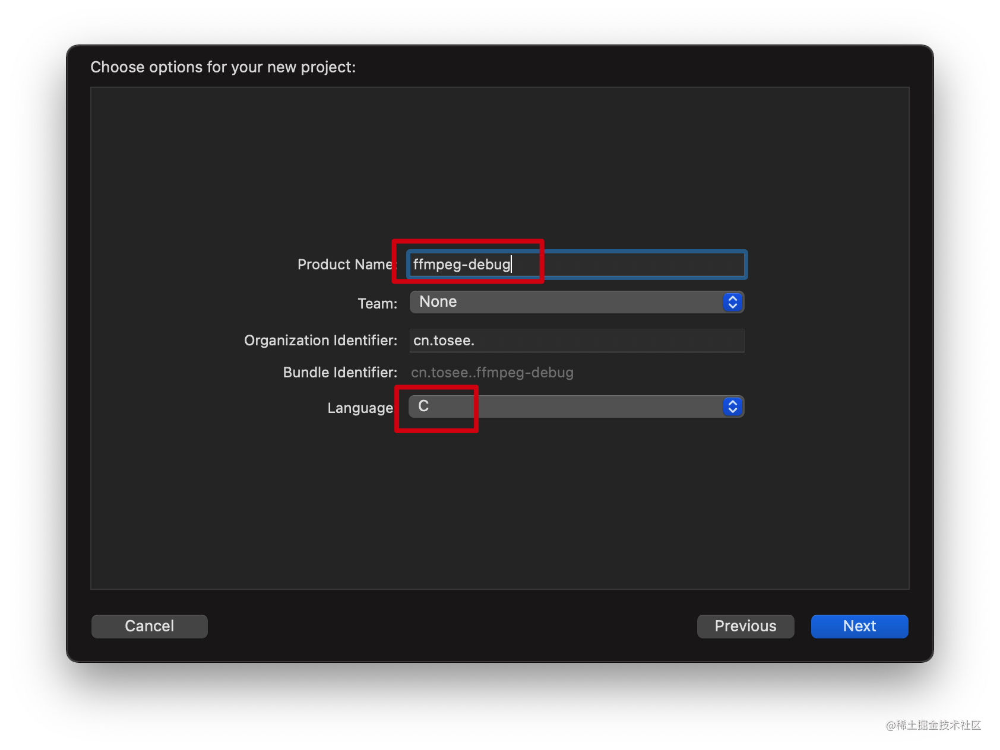
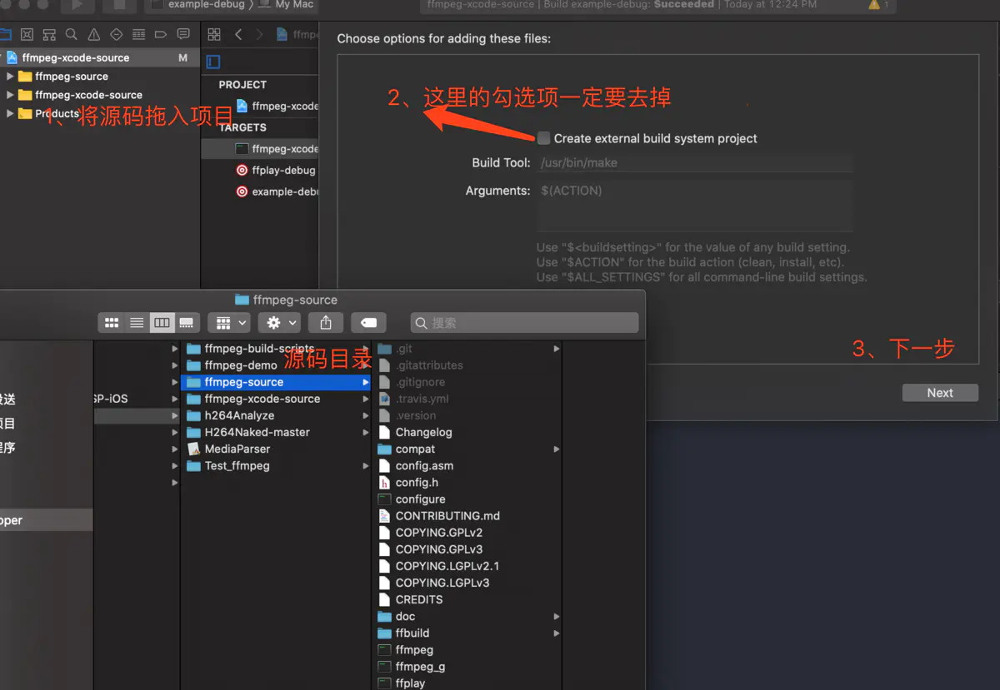
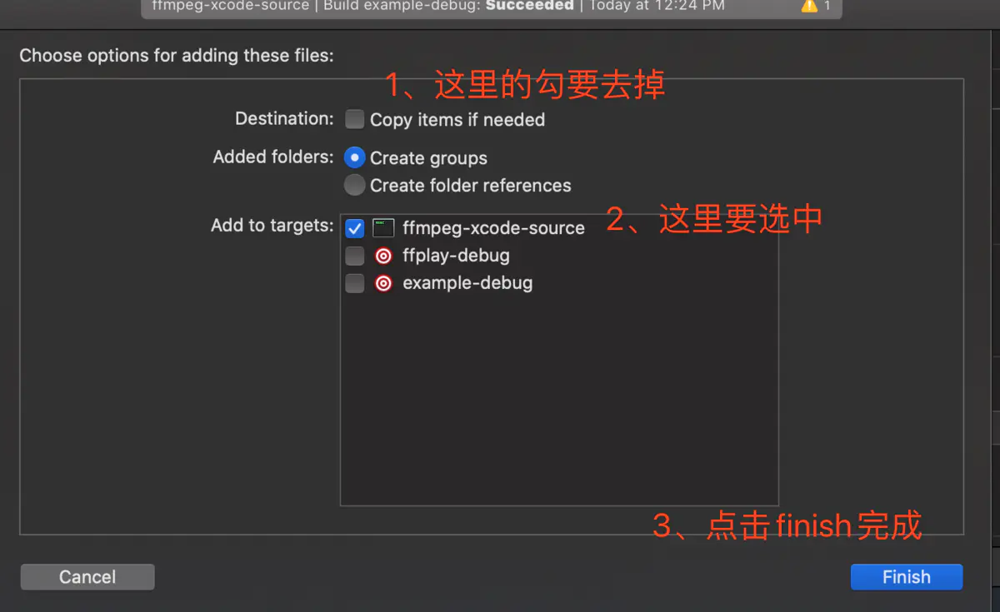
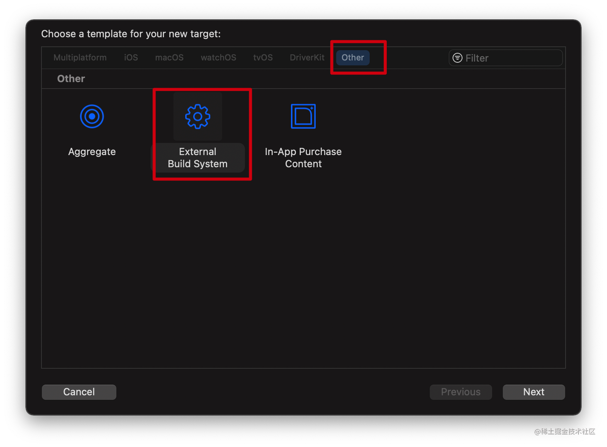
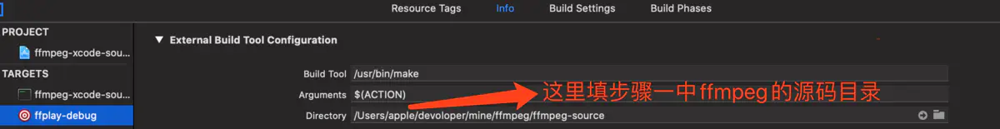
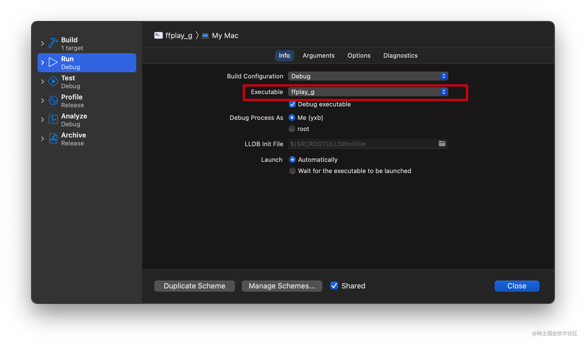
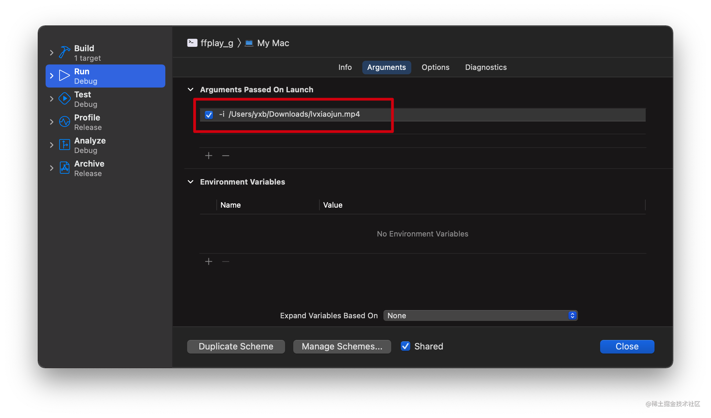

# FFmpeg Xcode 调试 


## 编译 ffmepg 

```c
./configure  --disable-optimizations --disable-stripping --enable-debug=3 --disable-doc
make -j `nproc`

./configure --enable-debug --enable-gpl --enable-libx264 \
--enable-nonfree --enable-libmp3lame --disable-optimizations

```

#### 可能依赖的库
* `brew install x264` 
* `brew install lame`

__以_g结尾的就是可以调试的程序ffmpeg_g, ffplay_g, ffprobe_g__ 


## Xcode 项目 
1. 创建 macos 项目 

  


2. 项目配置 
  


3. 添加 ffmepg 目录到工程中 

  

  

4. 添加 target 调试 
  
  
  

  


5. 更改代码后，重新调试 
    * make  重新编译出对应的可执行文件 


### 调试 example 

1. 编译 example 

```
// -o 代表生成中间编译代码，并且生成可执行程序
cd ffmpeg源码/examples
clang encode_video.c -o ./test/encode_video -I/usr/local/include -L/usr/local/lib/ -lavformat -lavcodec -lavutil -lavfilter -lswscale

./test/encode_video ./test/test.mp4 libx264

```
__此方式编译可能无法断点__ 

```
cd ffmpeg源码/
make examples

```


## 参考
[Xcode调试ffmpeg源码(十五)](https://link.juejin.cn/?target=https%3A%2F%2Fwww.jianshu.com%2Fp%2F27a90b113413) 


