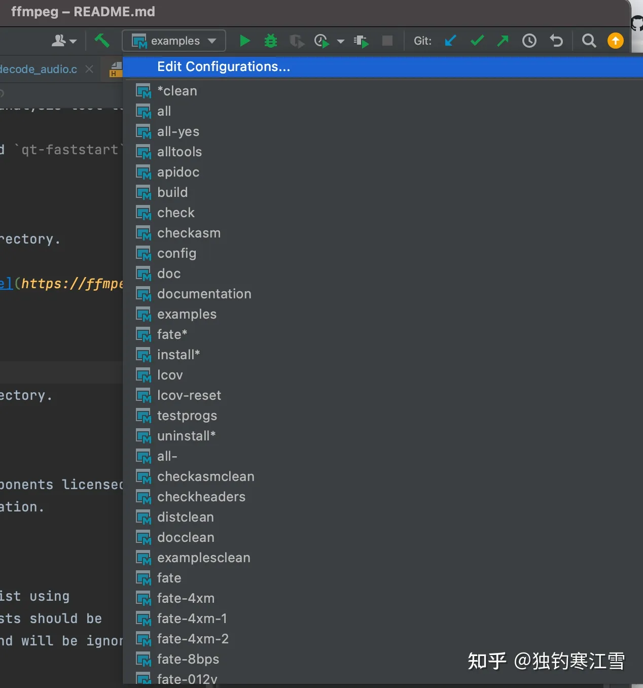
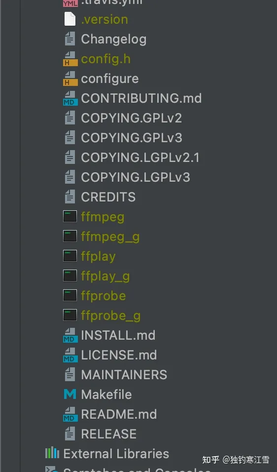
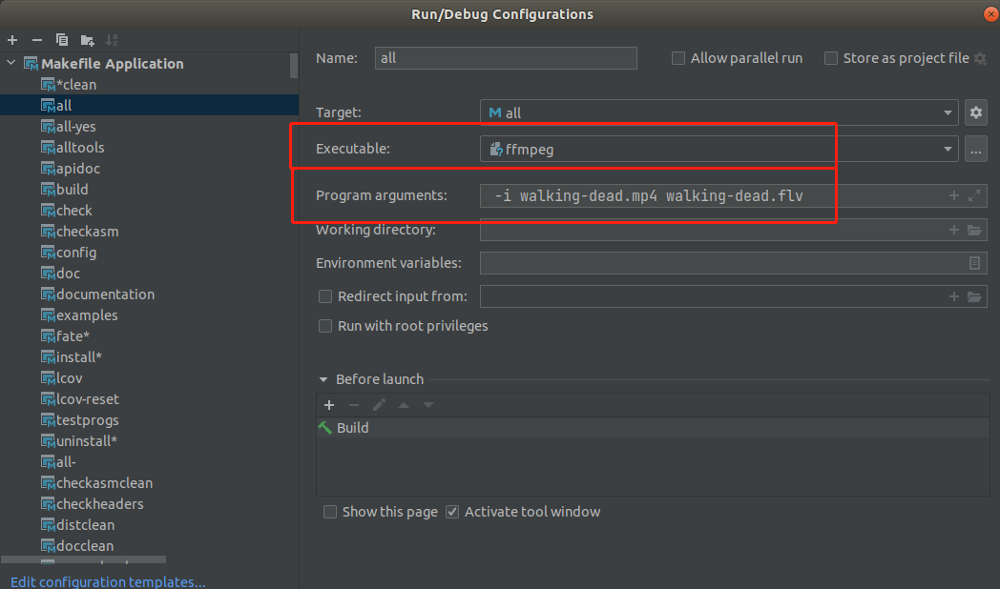
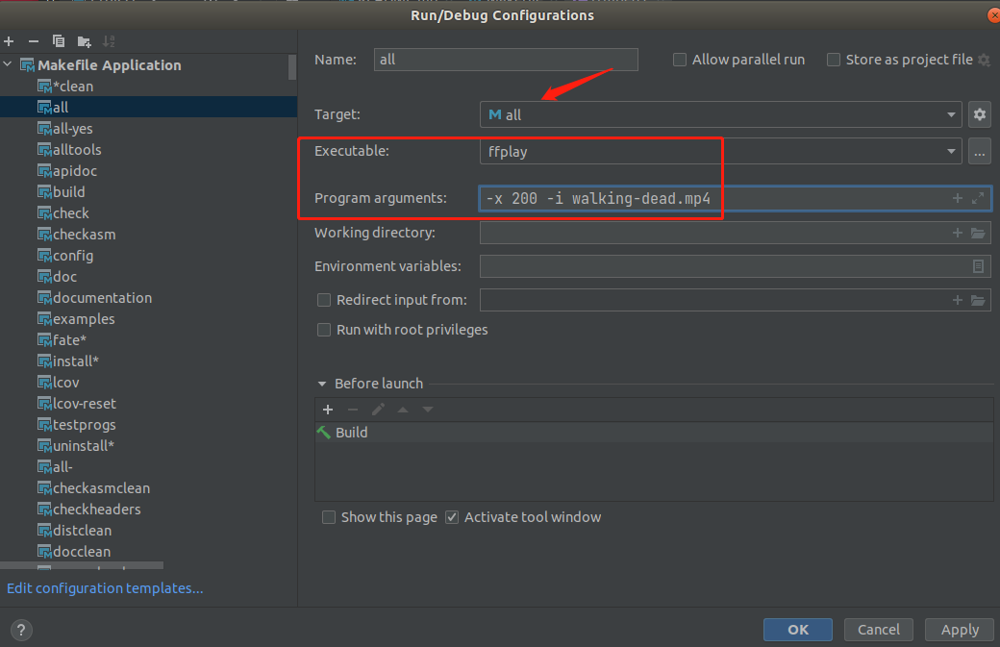
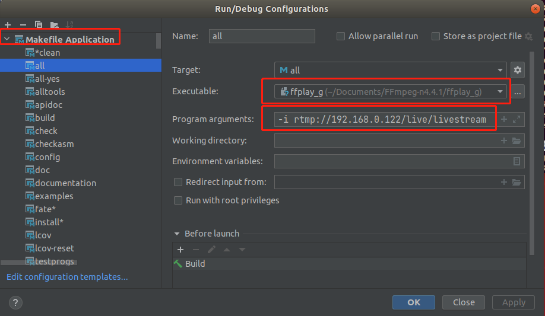

# FFmpeg Clion 调试 


## 编译 
1. deownload  source code ffmepg 
1.1 `make clean`
2. build 
    ```shell
    # 可以make 成功
    ./configure --enable-static --enable-debug --disable-optimizations --disable-asm --disable-stripping

    ./configure --prefix=/usr/local/ffmpeg
    --enable-static
    --enable-shared
    --enable-debug=3
    --enable-gpl
    --enable-libx264
    --enable-nonfree
    --disable-optimizations
    --disable-stripping
    --disable-asm

    ```
    > 编译命令： 
    ```
    --prefix=/usr/local/ffmpeg # 安装位置
    --enable-debug # 启动debug调试
    --enable-static # 编译静态库（默认开启）
    --enable-shared # 编译动态库（默认关闭）
    --enable-libvpx # VP8/VP9 视频编码器
    --enable-libvmaf # VMAF视频质量评估工具
    --disable-x86asm # 未知
    --enable-gpl # 允许使用GPL（默认关闭）
    --enable-nonfree # 允许使用非免费的代码， 产生的库和二进制程序将是不可再发行的
    --enable-libx264 # 启用H.264编码（默认关闭）
    --enable-libfdk-aac # 使能aac编码（默认关闭）
    --disable-optimizations # 禁用编译器优化
    --disable-asm # 禁用全部汇编程序优化
    --enable-librtmp # 使用librtmp拉流(默认关闭)
    ```  


3. make 
```
make

```


> configure是FFmpeg提供的配置脚本，用来生成Makefile跟config.h文件，Makefile在编译时使用，而config.h（里面各种宏的定义）被FFmpeg源码使用，也会影响到FFmpeg的功能裁剪。


## 导入 到 clion中 
1. 用 clion 打开项目 
2. 选择 all 并进行构建
  
3. 编译产物
  

__其中带_g的就是有调试信息的二进制文件__  


## 添加调试配置信息
1. 添加调试信息(ffmpeg)
  

2. 找到对应main 函数进行断点 

3. 调试 ffplay
  
> 


4. ffplay 支持直接调试流媒体 
  


