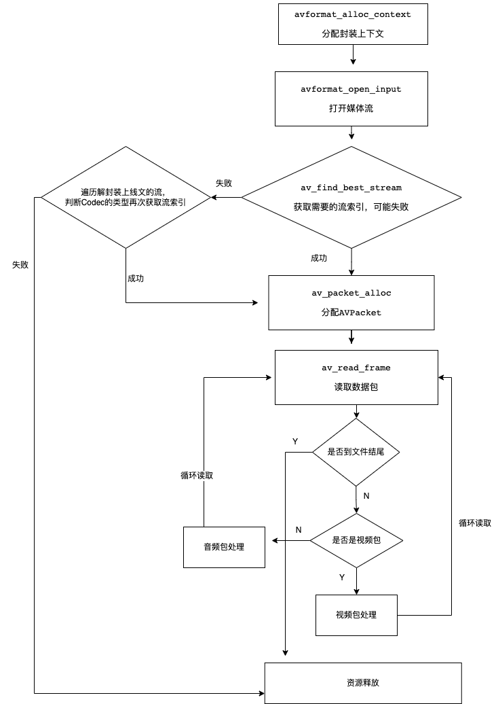

# FFmpeg 解包 

## 流程图
  


## 


## libavformat 
libavformat库，是FFmpeg中用于处理各种媒体容器格式的库，它描述了一个媒体文件或媒体流的构成和基本信息，它的两个主要功能就是封装和解封装，可以说它是贯穿整个FFmpeg的根。  

在解封装时，需要用到 avformat 中的几个函数: 
`avformat_alloc_context`: 封装结构体分配内存 // 可以不调用，avformat_open_input会判断入参是否为NULL，自行分配
`avformat_open_input`: 打开输入文件用于读取数据
`av_find_best_stream`: 获取流信息
`avformat_close_input`,
`avformat_open_input`,
`avformat_close_input`,
`avformat_close_input` 等函数 


### AVPacket 
AVPacket类，用于存储编码后的帧数据。 
一般由封装器导出，然后传递给解码器作为输入； 或者，从编码器作为输出，然后传递给封装器去进行写入


AVPacket可以表示一个视频包或者一个音频包，内部包含了这个视频包或音频包的播放时长，播放时间戳、二进制数据等相关信息。  

对于音视频等二进制数据，AVPacket内部使用了 __引用计数__ 的方式进行数据共享。

#### 函数调用过程 
```
avformat_alloc_context // 封装结构体分配内存 // 可以不调用，avformat_open_input会判断入参是否为NULL，自行分配 
avformat_open_input     // 打开文件
av_find_best_stream     // 获取流信息 
    // 一下是针对每条流的处理流程
    pFormatContext->nb_streams          
    avcodec_find_decoder        // 根据流中的编码参数AVCodecParameters，查找是否支持该编码 
    pLocalCodecParameters->codec_type   // 判断流类型
    保存AVCodecParameters和AVCodec，用于后续处理

    av_read_frame       // 读取AVPacket数据包

```


#### 提取视频

```c++
AVFormatContext *avFormatContext = nullptr;
AVPacket *avPacket = nullptr;
AVFrame *avFrame = nullptr;
FILE *h264_out = nullptr;
FILE *audio_out = nullptr;

AVBSFContext *bsf_ctx = nullptr;

// 默认 mp4解封装提取到的H264裸流是不带start code的， 无法播放，可以通过 h264_mp4toannexb过滤器，返回带有 start code 可以播放
void init_h264_mp4toannexb(AVCodecParameters *avCodecParameters) {
    if (nullptr == bsf_ctx) {
        const AVBitStreamFilter *bsfilter = av_bsf_get_by_name("h264_mp4toannexb");
        // 2 初始化过滤器上下文
        av_bsf_alloc(bsfilter, &bsf_ctx); //AVBSFContext;
        // 3 添加解码器属性
        avcodec_parameters_copy(bsf_ctx->par_in, avCodecParameters);
        av_bsf_init(bsf_ctx);
    }
}

void MediaDeMuxerCore::de_muxer_video(std::string media_path, std::string out_video_path) {
    // 分配上下文
    avFormatContext = avformat_alloc_context();
    // 打开输入文件
    avformat_open_input(&avFormatContext, media_path.c_str(), nullptr, nullptr);
    // 获取视频流索引
    int video_index = av_find_best_stream(avFormatContext, AVMEDIA_TYPE_VIDEO, -1, -1, nullptr, 0);
    if (video_index < 0) {
        std::cout << "没有找到视频流" << std::endl;
    } else {
        // 打印媒体信息
        av_dump_format(avFormatContext, 0, media_path.c_str(), 0);
        h264_out = fopen(out_video_path.c_str(), "wb");
        AVStream *video_stream = avFormatContext->streams[video_index];
        avPacket = av_packet_alloc();
        av_init_packet(avPacket);
        while (true) {
            int rect = av_read_frame(avFormatContext, avPacket);
            if (rect < 0) {
                std::cout << "视频流读取完毕" << std::endl;
                break;
            } else if (video_index == avPacket->stream_index) { // 只需要视频的
                std::cout << "写入视频size:" << avPacket->size << std::endl;
                // 这里需要注意一下，一般的mp4读出来的的packet是不带start code的，需要手动加上，如果是ts的话则是带上了start code的
                // 初始化过滤器，如果本身就是带了start code的调这个也没事，不会重复添加
                init_h264_mp4toannexb(video_stream->codecpar);

                if (av_bsf_send_packet(bsf_ctx, avPacket) != 0) {
                    av_packet_unref(avPacket);   // 减少引用计数
                    continue;       // 需要更多的包
                }
                av_packet_unref(avPacket);   // 减少引用计数
                while (av_bsf_receive_packet(bsf_ctx, avPacket) == 0) {
                    // printf("fwrite size:%d\n", pkt->size);
                    size_t size = fwrite(avPacket->data, 1, avPacket->size, h264_out);
                    av_packet_unref(avPacket); //减少引用计数
                }
            } else {
                av_packet_unref(avPacket); //减少引用计数
            }
        }
        // 刷
        fflush(h264_out);
    }
    avformat_close_input(&avFormatContext);
}

```


#### 提取音频 
音频需要 adts头信息的 才能播放， 这里添加 adts头信息的 的方式有两种： 
1. 对对adts比较熟悉的，可以在每个音频包的前面增加7个或者9个字节即可 
2. 使用FFmpeg的复用器封装功能，让其自动加上adts头信息 


> 使用内部复用器步骤：
1、调用 av_guess_format 让ffmpeg帮你找到一个合适的文件格式。
2、调用 avformat_new_stream 为输出文件创建一个新流。
3、调用 avio_open 打开新创建的文件。
4、调用 avformat_write_header 写文件头。
5、调用 av_interleaved_write_frame 写文件内容。
6、调用 av_write_trailer 写文件尾。
7、调用 avio_close 关闭文件


```c++
MediaDeMuxerCore.h

#include <iostream>

class MediaDeMuxerCore {

public:
    MediaDeMuxerCore();
    ~MediaDeMuxerCore();
    // 提取视频 h264裸流
    void de_muxer_video(std::string media_path,std::string out_video_path);
    // 提取音频 例如aac流
    void de_muxer_audio(std::string media_path,std::string out_audio_path);
    // 使用容器封装的方式提取aac流
    void de_muxer_audio_by_stream(std::string media_path,std::string out_audio_path);

private:

};


MediaDeMuxerCore.cpp

#include "MediaDeMuxerCore.h"

extern "C" {
#include <libavcodec/avcodec.h>
#include <libavutil/avutil.h>
#include <libavformat/avformat.h>
#include <libavcodec/bsf.h>
}

MediaDeMuxerCore::MediaDeMuxerCore() {

}

AVFormatContext *avFormatContext = nullptr;
AVPacket *avPacket = nullptr;
AVFrame *avFrame = nullptr;
FILE *h264_out = nullptr;
FILE *audio_out = nullptr;

AVBSFContext *bsf_ctx = nullptr;

void init_h264_mp4toannexb(AVCodecParameters *avCodecParameters) {
    if (nullptr == bsf_ctx) {
        const AVBitStreamFilter *bsfilter = av_bsf_get_by_name("h264_mp4toannexb");
        // 2 初始化过滤器上下文
        av_bsf_alloc(bsfilter, &bsf_ctx); //AVBSFContext;
        // 3 添加解码器属性
        avcodec_parameters_copy(bsf_ctx->par_in, avCodecParameters);
        av_bsf_init(bsf_ctx);
    }
}

void MediaDeMuxerCore::de_muxer_video(std::string media_path, std::string out_video_path) {
    // 分配上下文
    avFormatContext = avformat_alloc_context();
    // 打开输入文件
    avformat_open_input(&avFormatContext, media_path.c_str(), nullptr, nullptr);
    // 获取视频流索引
    int video_index = av_find_best_stream(avFormatContext, AVMEDIA_TYPE_VIDEO, -1, -1, nullptr, 0);
    if (video_index < 0) {
        std::cout << "没有找到视频流" << std::endl;
    } else {
        // 打印媒体信息
        av_dump_format(avFormatContext, 0, media_path.c_str(), 0);
        h264_out = fopen(out_video_path.c_str(), "wb");
        AVStream *video_stream = avFormatContext->streams[video_index];
        avPacket = av_packet_alloc();
        av_init_packet(avPacket);
        while (true) {
            int rect = av_read_frame(avFormatContext, avPacket);
            if (rect < 0) {
                std::cout << "视频流读取完毕" << std::endl;
                break;
            } else if (video_index == avPacket->stream_index) { // 只需要视频的
                std::cout << "写入视频size:" << avPacket->size << std::endl;
                // 这里需要注意一下，一般的mp4读出来的的packet是不带start code的，需要手动加上，如果是ts的话则是带上了start code的
                // 初始化过滤器，如果本身就是带了start code的调这个也没事，不会重复添加
                init_h264_mp4toannexb(video_stream->codecpar);

                if (av_bsf_send_packet(bsf_ctx, avPacket) != 0) {
                    av_packet_unref(avPacket);   // 减少引用计数
                    continue;       // 需要更多的包
                }
                av_packet_unref(avPacket);   // 减少引用计数
                while (av_bsf_receive_packet(bsf_ctx, avPacket) == 0) {
                    // printf("fwrite size:%d\n", pkt->size);
                    size_t size = fwrite(avPacket->data, 1, avPacket->size, h264_out);
                    av_packet_unref(avPacket); //减少引用计数
                }
            } else {
                av_packet_unref(avPacket); //减少引用计数
            }
        }
        // 刷
        fflush(h264_out);
    }
    avformat_close_input(&avFormatContext);
}


const int sampling_frequencies[] = {
        96000,  // 0x0
        88200,  // 0x1
        64000,  // 0x2
        48000,  // 0x3
        44100,  // 0x4
        32000,  // 0x5
        24000,  // 0x6
        22050,  // 0x7
        16000,  // 0x8
        12000,  // 0x9
        11025,  // 0xa
        8000   // 0xb
        // 0xc d e f是保留的
};

int adts_header(char *const p_adts_header, const int data_length,
                const int profile, const int samplerate,
                const int channels) {

    int sampling_frequency_index = 3; // 默认使用48000hz
    int adtsLen = data_length + 7;

    // 匹配采样率
    int frequencies_size = sizeof(sampling_frequencies) / sizeof(sampling_frequencies[0]);
    int i = 0;
    for (i = 0; i < frequencies_size; i++) {
        if (sampling_frequencies[i] == samplerate) {
            sampling_frequency_index = i;
            break;
        }
    }
    if (i >= frequencies_size) {
        std::cout << "没有找到支持的采样率" << std::endl;
        return -1;
    }

    p_adts_header[0] = 0xff;         //syncword:0xfff                          高8bits
    p_adts_header[1] = 0xf0;         //syncword:0xfff                          低4bits
    p_adts_header[1] |= (0 << 3);    //MPEG Version:0 for MPEG-4,1 for MPEG-2  1bit
    p_adts_header[1] |= (0 << 1);    //Layer:0                                 2bits
    p_adts_header[1] |= 1;           //protection absent:1                     1bit

    p_adts_header[2] = (profile) << 6;            //profile:profile               2bits
    p_adts_header[2] |=
            (sampling_frequency_index & 0x0f) << 2; //sampling frequency index:sampling_frequency_index  4bits
    p_adts_header[2] |= (0 << 1);             //private bit:0                   1bit
    p_adts_header[2] |= (channels & 0x04) >> 2; //channel configuration:channels  高1bit

    p_adts_header[3] = (channels & 0x03) << 6; //channel configuration:channels 低2bits
    p_adts_header[3] |= (0 << 5);               //original：0                1bit
    p_adts_header[3] |= (0 << 4);               //home：0                    1bit
    p_adts_header[3] |= (0 << 3);               //copyright id bit：0        1bit
    p_adts_header[3] |= (0 << 2);               //copyright id start：0      1bit
    p_adts_header[3] |= ((adtsLen & 0x1800) >> 11);           //frame length：value   高2bits

    p_adts_header[4] = (uint8_t) ((adtsLen & 0x7f8) >> 3);     //frame length:value    中间8bits
    p_adts_header[5] = (uint8_t) ((adtsLen & 0x7) << 5);       //frame length:value    低3bits
    p_adts_header[5] |= 0x1f;                                 //buffer fullness:0x7ff 高5bits
    p_adts_header[6] = 0xfc;      //‭11111100‬       //buffer fullness:0x7ff 低6bits

    return 0;
}

/**
 * @param media_path
 * @param out_audio_path
 */
void MediaDeMuxerCore::de_muxer_audio(std::string media_path, std::string out_audio_path) {
    // 分配上下文
    avFormatContext = avformat_alloc_context();
    // 打开输入文件
    avformat_open_input(&avFormatContext, media_path.c_str(), nullptr, nullptr);
    // 获取视频流索引
    int audio_index = av_find_best_stream(avFormatContext, AVMEDIA_TYPE_AUDIO, -1, -1, nullptr, 0);
    audio_out = fopen(out_audio_path.c_str(), "wb");
    if (audio_index < 0) {
        std::cout << "没有找到音频流" << std::endl;
    } else {
        // 打印媒体信息
        av_dump_format(avFormatContext, 0, media_path.c_str(), 0);
        audio_out = fopen(out_audio_path.c_str(), "wb");
        AVStream *audio_stream = avFormatContext->streams[audio_index];
        avPacket = av_packet_alloc();
        av_init_packet(avPacket);
        while (true) {
            int rect = av_read_frame(avFormatContext, avPacket);
            if (rect < 0) {
                std::cout << "音频流读取完毕" << std::endl;
                break;
            } else if (audio_index == avPacket->stream_index) { // 只需要音频的
                // adts 头是7个字节，也有可能是9个字节
                char adts_header_buf[7] = {0};
                adts_header(adts_header_buf, avPacket->size,
                            avFormatContext->streams[audio_index]->codecpar->profile,
                            avFormatContext->streams[audio_index]->codecpar->sample_rate,
                            avFormatContext->streams[audio_index]->codecpar->channels);
                // 先写adts头，有些是解封装出来就带有adts头的比如ts
                fwrite(adts_header_buf, 1, 7, audio_out);
                // 写入aac包
                fwrite(avPacket->data, 1, avPacket->size, audio_out);
                av_packet_unref(avPacket); //减少引用计数
            } else {
                av_packet_unref(avPacket); //减少引用计数
            }
        }
        // 刷流
        fflush(audio_out);
    }

}

void MediaDeMuxerCore::de_muxer_audio_by_stream(std::string media_path, std::string out_audio_path) {
    // 分配上下文
    avFormatContext = avformat_alloc_context();
    // 打开输入文件
    avformat_open_input(&avFormatContext, media_path.c_str(), nullptr, nullptr);
    // 获取视频流索引
    int audio_index = av_find_best_stream(avFormatContext, AVMEDIA_TYPE_AUDIO, -1, -1, nullptr, 0);
    audio_out = fopen(out_audio_path.c_str(), "wb");
    if (audio_index < 0) {
        std::cout << "没有找到音频流" << std::endl;
    } else {
        std::cout << "音频时长:" << avFormatContext->streams[audio_index]->duration * av_q2d(avFormatContext->streams[audio_index]->time_base) << std::endl;
        AVFormatContext *out_format_context = avformat_alloc_context();
        const AVOutputFormat *avOutputFormat = av_guess_format(nullptr,out_audio_path.c_str(), nullptr);
        out_format_context->oformat = avOutputFormat;

        AVStream *aac_stream = avformat_new_stream(out_format_context, NULL);
        // 编码信息拷贝
        int ret = avcodec_parameters_copy(aac_stream->codecpar,avFormatContext->streams[audio_index]->codecpar);
        ret = avio_open(&out_format_context->pb,out_audio_path.c_str(),AVIO_FLAG_WRITE);
        if(ret < 0){
            std::cout << "输出流打开失败" << std::endl;
        }
        avformat_write_header(out_format_context, nullptr);
        avPacket = av_packet_alloc();
        av_init_packet(avPacket);
        while (true){
            ret = av_read_frame(avFormatContext,avPacket);
            if(ret < 0){
                std::cout << "read end " << std::endl;
                break;
            }
            if(avPacket->stream_index == audio_index){
                avPacket->stream_index = aac_stream->index;
                // 时间基转换
                av_packet_rescale_ts(avPacket,avPacket->time_base,aac_stream->time_base);
                ret = av_write_frame(out_format_context,avPacket);
               if(ret < 0){
                   std::cout << "aad 写入失败" << std::endl;
               } else{
                   std::cout << "aad 写入成功"  << std::endl;
               }
            }
            av_packet_unref(avPacket);
        }
        av_write_trailer(out_format_context);
        avformat_flush(out_format_context);
    }

}

MediaDeMuxerCore::~MediaDeMuxerCore() {
    if (nullptr != avFormatContext) {
        avformat_free_context(avFormatContext);
    }
    if (nullptr != avPacket) {
        av_packet_free(&avPacket);
    }
    if (nullptr != avFrame) {
        av_frame_free(&avFrame);
    }
    if (nullptr != h264_out) {
        fclose(h264_out);
        h264_out = nullptr;
    }
    if (nullptr != audio_out) {
        fclose(audio_out);
        audio_out = nullptr;
    }
    if (nullptr != bsf_ctx) {
        av_bsf_free(&bsf_ctx);
    }
}

```


