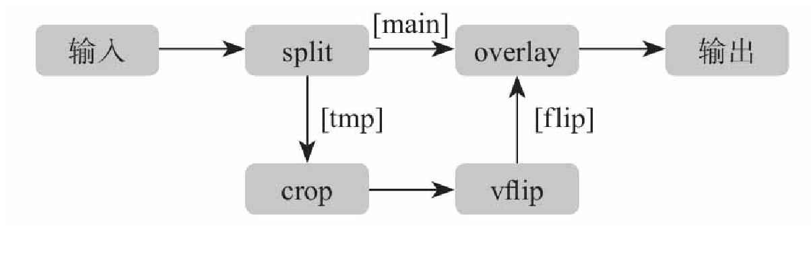
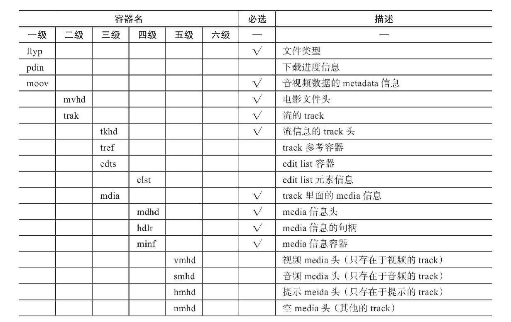

## FFmpeg
##### FFmpeg定义  
FFmpeg 提供了多种媒体格式封装和解封装，包括多种音视频编码、多种协议流媒体、多种色彩格式转换、多种采样率转换、多种码率转换等。
FFMpeg 的基本组成包含 `AVFormat`,`AVCodec`,`AVFliter`,`AVDevice`,`AVUtil` 等模块组成  
```
    AVFormat        AVCodec         AVFliter        AVDevice
            AVUtil          swresample          swscale
```

#### 常用功能模块
* libavformat:多媒体文件或协议的封装和解封装库，如 Mp4、Flv 等文件封装格式，RTMP、RTSP 等网络协议封装格式；
* libavcodec：音视频编解码库；
* libavfilter：音视频、字幕滤镜库；
* libswscale：图像格式转换库；
* libswresample：音频重采样库；
* libavutil：工具库；


-------------- 

* AVFormat 
    __封装模块__，FFMpeg 本身已经支持了绝大多数的格式，例如 MP4，FLV,KV,TS等文件格式和 RTMP,RTSP,MMS,HLS等网络协议格式。但是否使用，需要在编译时增加对应的功能模块  
* AVCodec
    __编解码模块__,AVCodec中实现了觉大都数的编解码格式。例如： MPEG4,AAC,MJPEG等自带的编解码格式， 还支持第三方的编解码器， H.264(AVC),H.265(HEVC)此处需要 x264编码器。MP3比那吗等，如果需要增加自己的编码格式，旭要在AVCodec中增加相应的编解码模块。

* AVFliter
    __滤镜模块__,提供了一个通用的音频，视频， 字幕等滤镜处理框架。 在 AVFilter中滤镜可以又多个输入和输出。
     
    > 将输入的视频切割成两部分流， 一部分流抛给 `crop` 滤镜和`vflip`滤镜处理，另外一部分原样， 当出列结束后，将流合并到原有的overlay图层中，并在最上层显示，输出新的视频。   
* swscale
    __视频图像转换计算模块__, 提供了高级图像缩放和像素格式转换
* swresample
    __音频转换计算模块__, 提供了高级别的音频重采样API。 允许操作，音频采样、音频通道布局转换与布局调整。  

##### 主要工作流程 
* 解封装(Demuxing) 
* 解码(Decoding) 
* 编码(Encoding) 
* 封装(Muxing)   
需要经过六个步骤： 
1. 读取输入源 
2. 进行音视频的解封装 
3. 解码每一帧音视频数据  
4. 编码每一帧音视频数据  
5. 进行音视频的重新封装 
6. 输出到目标  


##### FFmpeg 工具 
* ffplay
    播放器，可以用于测试  
* ffprobe
    多媒体分析工具，可以从媒体文件或媒体流中获取到媒体信息。

#### 编译安装 
* LLVM 
* yasm 


## 常用命令  
* ffmpeg
* ffprobe 
* ffplay 

## 转封装  
#### MP4 格式 
MP4格式文件由许多的`Box` 和 `FullBox` 组成  
每个 `Box` 由`Header` 和 `Data` 两部分组成  
`FullBox` 是 Box 的扩展，其在 Box 结构的基础上，在 Header 中增加了 version 标志和 24 位的 flags标志  
* Header 
    包含 了整个 Box 的长度和类型  
    * size = 0: 这个box 文件不是最后一个 Box  
    * size = 1: 这个box 长度需要更多的位描述， 在后面定义一个 64 位的 largesize 来描述长度。  
    * type = uuid: 这个box 数据是用户自定义扩展类型
* Data 
    是Box 的数据，可以是纯数据， 也可以是更多的 子 Box (当前Box位容器Box)  
      

