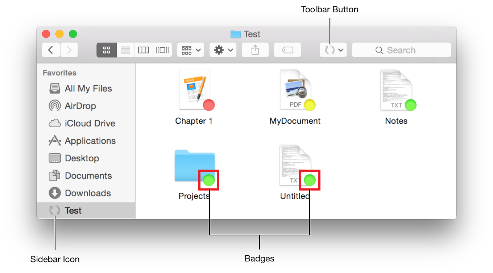

## FinderSync 插件

可让您干净、安全地修改 Finder 的用户界面，以表达文件同步状态和控制， 访达同步不会向主机应用添加功能。它允许您修改Finder本身的行为。 为受监视文件夹中的任何项目设置锁屏提醒、标签和上下文菜单。您还可以使用扩展点的 API 将工具栏按钮添加到 Finder 窗口或被监视者的侧边栏图标



### 功能点
1. 注册一组要监视的文件夹。
2. 当用户开始或停止浏览受监控文件夹的内容时接收通知。
3. 在受监控文件夹中的项目上添加、删除和更新徽章和标签。
4. 当用户按住 Control 键单击受监视文件夹内的项目时，显示上下文菜单。
5. 将自定义按钮添加到 Finder 的工具栏。(与徽章和上下文菜单项不同，此按钮始终可用，即使用户当前未浏览受监控的文件夹。)


## 在 Xcode 中创建 Finder 同步扩展 
**FIFinderSync**： 该子类充当扩展的主要类。系统自动实例化该类并调用协议方法以响应用户操作   

### 设置所需的属性列表 

```
<key>NSExtension</key>
<dict>
    <key>NSExtensionAttributes</key>
    <dict/>
    <key>NSExtensionPointIdentifier</key>
    <string>com.apple.FinderSync</string>
    <key>NSExtensionPrincipalClass</key>
    <string>$(PRODUCT_MODULE_NAME).FinderSync</string>
</dict>
```


### 指定要监控的文件夹 
可以在 Extensions 初始化的时候，使用默认的 *FIFinderSyncController* 对象指定要监控的文件夹。 可以使用共享用户默认值在包含应用程序和您的 Finder Sync 扩展程序之间传递此数据。

```
<key>com.apple.security.application-groups</key>
<array>
    <string>com.example.domain.MyFirstFinderSyncApp</string>
</array>

```

初始化 NSUserDefaults  

```
// Set up the folder we are syncing.
NSUserDefaults *sharedDefaults =
[[NSUserDefaults alloc] initWithSuiteName:@"com.example.domain.MyFirstFinderSyncExtension"];
 
self.myFolderURL = [sharedDefaults URLForKey:MyFolderKey];
 
if (self.myFolderURL == nil) {
    self.myFolderURL = [NSURL fileURLWithPath:[@"~/Documents/MyFirstFinderSyncExtension Documents" stringByExpandingTildeInPath]];;
}
 
[FIFinderSyncController defaultController].folderURLs = [NSSet setWithObject:self.myFolderURL];

```


### 设置 bardge 
* 视网膜屏幕12x12 到 320x320
* 非视网膜屏幕8x8 到 160x160  

```
[[FIFinderSyncController defaultController]
 setBadgeImage: uploadedImage
 label: NSLocalizedString(@"Uploaded", nil)
 forBadgeIdentifier: @"UploadComplete"];

```
在同步控制器的初始化方法中执行此操作, 可以根据需要设置任意数量的徽章图像

### 实现 FIFinderSync 方法  
该FIFinderSync协议声明了许多方法，您可以实现这些方法来监视和控制 Finder。这些方法可让您在用户观察监控项时收到通知，向监控项添加上下文菜单，并添加自定义工具栏和侧边栏图标。


### 添加上下文菜单 


## 参考  
https://developer.apple.com/library/archive/documentation/General/Conceptual/ExtensibilityPG/Finder.html
 


