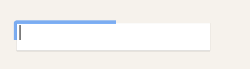
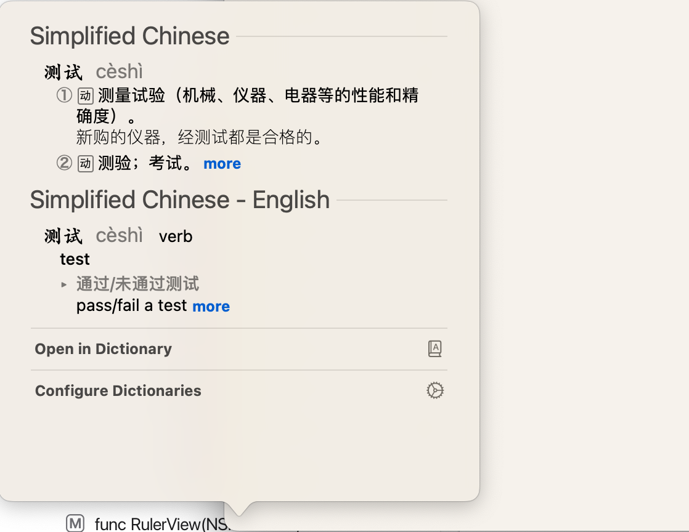

# 外貌

#### var allowsVibrancy: Bool 
> 一个布尔值，指示视图是否确保其在其他内容之上充满活力。 
```swift
let containerView = _NSVisualEffectView(frame: view.bounds)
containerView.material = .sidebar
containerView.blendingMode = .withinWindow
containerView.state = .active

let label = NSTextField(labelWithString: "Hello, World!")
label.font = NSFont.systemFont(ofSize: 20)
label.textColor = NSColor.white
label.frame = NSRect(x: 20, y: 20, width: 200, height: 30)

containerView.addSubview(label)
view.addSubview(containerView)

class _NSVisualEffectView: NSVisualEffectView {
    // TODO: 会使模糊效果失效的样式
    override var allowsVibrancy: Bool {
        return true
    }
}

```

## Drawing the Focus Ring 
#### var focusRingType: NSFocusRingType
> 围绕视图绘制的聚焦环的类型。 

```swift 
let textField = NSTextField(frame: NSRect(x: 20, y: 20, width: 200, height: 30))
//        textField.focusRingType = .exterior // 蓝色边框
//        textField.focusRingType = .default  // 默认的
textField.focusRingType = .none       // 没有聚焦效果
view.addSubview(textField)

```

#### var focusRingMaskBounds: NSRect 
> 聚焦环遮罩边界，在视图的坐标空间中指定。影响 __遮罩的位置和大小__
```swift 
let textField = _NSTextField(frame: NSRect(x: 20, y: 20, width: 200, height: 30))
textField.focusRingType = .exterior
view.addSubview(textField)
class _NSTextField: NSTextField {
    override var focusRingMaskBounds: NSRect {
        return NSRect.init(x: 0, y: 0, width: bounds.width / 2, height: bounds.height / 2)
    }
}
```
  


#### func drawFocusRingMask() 
> 绘制视图的聚焦环遮罩。

```swift 
// 重写此方法，自定义绘制焦点环的遮罩
override func drawFocusRingMask() {
    // 如果这里不调用 super, 就和取消聚焦环效果一样
}


```


#### func noteFocusRingMaskChanged() 
> 调用以通知视图聚焦环遮罩需要更新。
需要注意的是，只有当应用程序的某些内部状态发生变化（AppKit 无法确定）影响聚焦环遮罩的形状时，开发人员才需要调用此方法。
假设如果视图被标记为需要显示或调整大小，则其焦点环形状可能已更改，并且在这种情况下客户端不需要显式发送此消息，它们会自动处理。
但是，如果视图在其内容的某些部分（可能是NSImage）周围显示焦点环，并且该内容发生更改，则客户端必须通过调用此方法来提供通知，以便调用 focusRingMaskBounds 和 drawFocusRingMask（） 来重绘焦点环。 

#### func setKeyboardFocusRingNeedsDisplay(_ rect: NSRect) 
> 使聚焦环周围的区域无效。
调用 `setKeyboardFocusRingNeedsDisplay(_:) ` 方法会影响到视图的 `needsDisplay` 属性，将其设置为 `true`。这将导致视图系统在下一次绘制循环中重新调用 `drawRect(_:)` 方法以绘制焦点环。


## 核心动画支持  

#### var wantsUpdateLayer: Bool 
> 一个布尔值，指示视图在更新其内容时采用的绘制路径。
> 视图可以使用两种技术之一更新其内容, 它可以使用其 `draw(_:)` 方法绘制这些内容,也可以直接修改其底层`Layer`对象. 在视图更新周期中，每个脏视图都会自行调用此方法，以确定要使用的技术。 此方法的默认实现返回 `false` 这导致视图使用其 `draw(_:)` 方法。   
如果您的视图是 layer-backed 的,并且通过修改其层来更新自身, 重写此属性并将返回值更改为 true, 修改图层比使用 draw（_：） 重绘图层内容要快得多, 
如果覆盖此属性为 `true`,则还 __必须覆盖视图的 `updateLayer()` 方法__ ,并使用它来更改图层, 请勿在此属性的实现中修改层。你的实现应该快速返回 true 或 false,而不是执行其他任务。  

__如果 canDrawSubviewsIntoLayer 属性设置为 true，则视图将忽略此方法返回的值。相反，视图始终使用其 draw（_：）绘制其内容的方法。__  

__当使用 updateLayer() 方法更新视图时,建议您将视图的重绘策略设置为 NSView.LayerContentsRedrawPolicy.onSetNeedsDisplay。此策略可让您控制何时要更新图层的内容。__  


#### var canDrawSubviewsIntoLayer: Bool { get set } 
> 一个布尔值，指示视图是否将其子视图中的内容合并到其自己的图层中。  

当此属性的值为 时true，任何具有隐式创建的图层（即您未显式设置 wantsLayer = true）的子视图都会将其内容绘制到当前视图的图层中。换句话说，子视图没有自己的层，他们将内容绘制到父视图的图层中。操作中涉及的所有视图都使用其 draw（_：） 绘制其内容方法。  它们不使用 updateLayer（） 方法来更新其图层内容，即使 wantsUpdateLayer 属性设置为 true。

使用此属性可以平展层支持的视图及其子视图的层层次结构。拼合层层次结构可减少视图层次结构使用的层数（并可能减少内存量）。在子视图之间存在显著重叠或视图和子视图的内容没有显著变化的情况下，减少层数可以更有效。例如，平展层次结构可减少将视图组合在一起所花费的时间。如果计划对该层次结构中的一个或多个子视图进行动画处理，请不要平展视图层次结构。


更改此属性的值时，`当前视图必须具有图层对象`。此属性的默认值为 false。


## 相关用户界面 
管理上下文菜单、光标、工具提示以及其他系统提供的窗口和内容。  

### 响应光标移动
#### func addCursorRect(NSRect, cursor: NSCursor) 
> 设置当鼠标指针位于指定区域内时要使用的光标。


#### func discardCursorRects() 
> 使所有`addCursorRect(NSRect, cursor: NSCursor) ` 设置无效  


#### func resetCursorRects() 
> 由子类覆盖以定义其默认光标矩形。
请注意，在某些情况下，例如当视图的大小或位置发生变化时，你可能需要在 resizeSubviews(withOldSize:) 或 setFrame(_:) 等方法中调用 resetCursorRects() 方法来更新光标矩形。

```swift 
class CustomView: NSView {
    override func resetCursorRects() {
        super.resetCursorRects()
        
        // 移除之前的所有光标矩形
        discardCursorRects()
        
        // 添加新的光标矩形
        addCursorRect(bounds, cursor: .pointingHand)
    }
}

```


#### class var focusView: NSView? 
>  获取当前焦点视图， 没有时是 nil 
NSView.focusView 是一个只读属性，用于获取当前视图中的焦点视图（focused view）。这个属性返回焦点视图，也就是当前响应链中的第一个响应者（First Responder）。如果焦点视图不存在或尚未设置，它将返回 nil。
在视图系统中，焦点视图指的是可以接收键盘事件和操作的视图。焦点视图通常是由用户手动选中或通过编程方式设置的。 
如果 NSView.focusView 总是返回 nil，可能有以下几个原因：
1. 没有焦点视图：你在应用程序中可能没有设置焦点视图，或者焦点视图还未获得焦点（成为第一个响应者）。在视图层次结构中设置焦点视图，并调用 makeFirstResponder(_:) 方法将其设置为第一个响应者。
2. 键盘事件未正确传递：如果焦点视图是嵌套在父视图中的视图，确保正确地将键盘事件传递给焦点视图。父视图应该调用 hitTest(_:) 或 nextKeyView 方法，以确保事件在焦点视图中得到处理。


> 注意：  
默认情况下，NSTextField 是 NSTextView 的子类，而实际上是 NSTextView 处理文本的编辑。NSTextField 内部实际上嵌入了一个 NSTextView 来实现可编辑部分。因此，在 NSTextField 上访问 NSView 的 focusView 属性时，它会返回 nil，因为实际的编辑视图并不被视为焦点视图。
如果你想知道在 NSTextField 中当前处理键盘事件的第一个响应者是哪个视图，你可以使用 NSWindow 的 firstResponder 属性。以下是如何在 NSTextField 中访问第一个响应者的示例： 
```swift 
if let window = textField.window, let firstResponder = window.firstResponder as? NSView {
    // 在这里访问第一个响应者视图
    // 它可能是 NSTextField、NSTextView 或其他 NSView 的子类
}
```
通过访问窗口的 firstResponder 属性，你可以获取当前处理键盘事件的实际视图，包括位于 NSTextField 内部的编辑视图。

#### func showDefinition(for: NSAttributedString?, at: NSPoint)
> 显示一个字典详情 popver 窗口，
  
