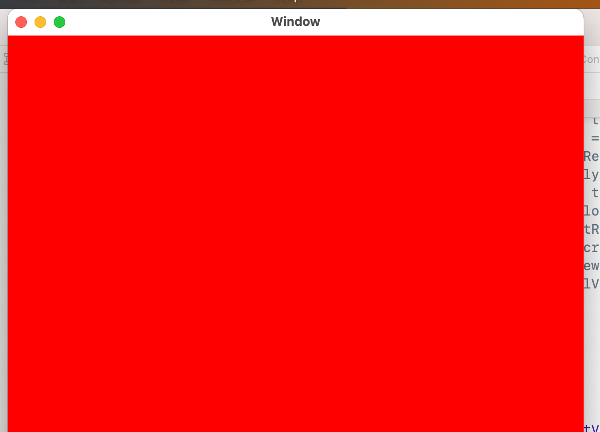
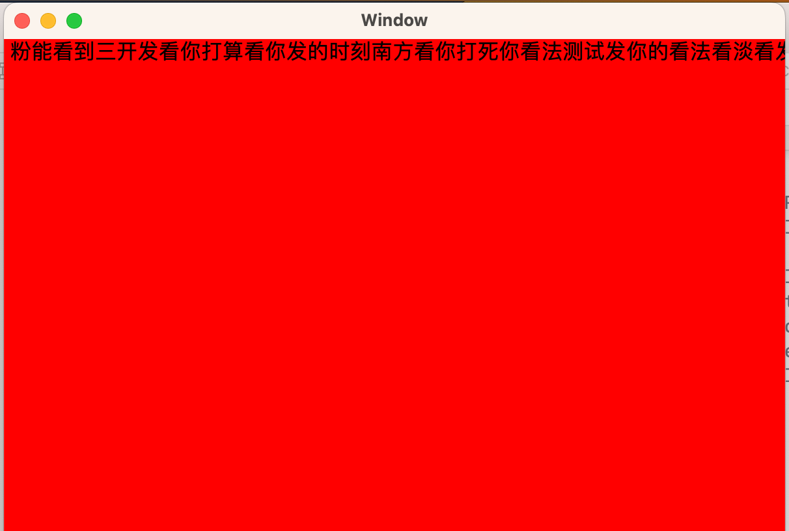
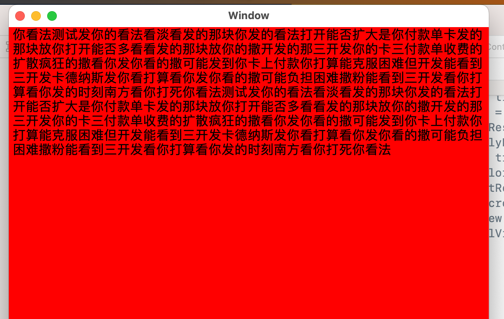
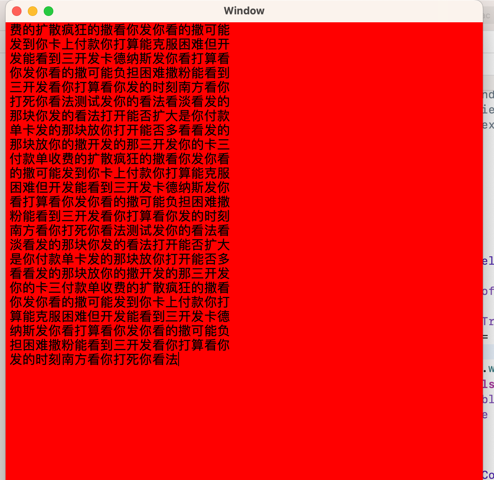
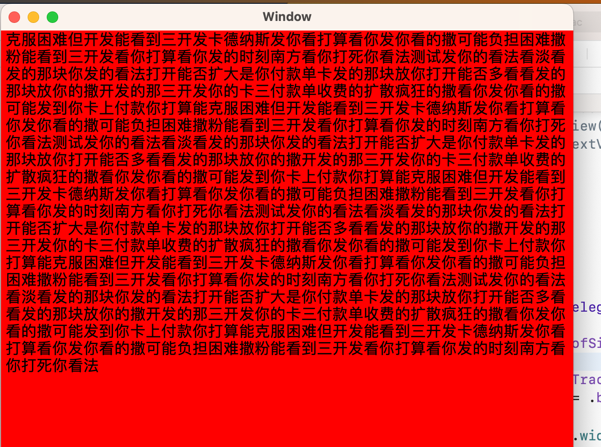
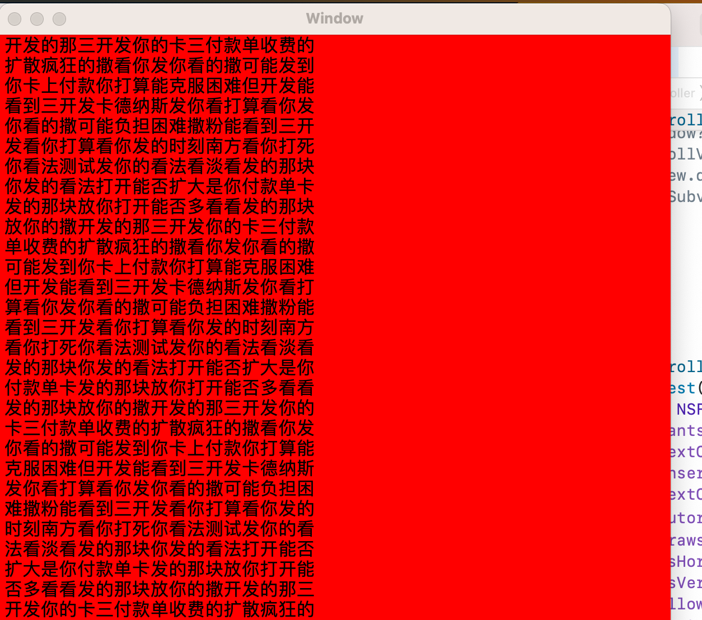

## NSTextView  

### 创建基础的 
```swift 


let font = NSFont.systemFont(ofSize: 16)
textView.wantsLayer = true
textView.textContainer?.widthTracksTextView = true
textView.insertionPointColor = .black
textView.textColor = .black
textView.autoresizingMask = [.width, .height]  // 这个影响内容无法显示,这个不正确或者没有会导致内容不显示
textView.drawsBackground = false
textView.isHorizontallyResizable = false
textView.isVerticallyResizable = true
textView.allowsUndo = true
textView.font = font
textView.delegate = self
textView.backgroundColor = NSColor.clear
scrollView.documentView = textView
textView.drawsBackground = true
textView.backgroundColor = NSColor.red

```

`autoresizingMask` 与 `textContainer?.widthTracksTextView` 将是配合使用的 
当 `autoresizingMask` 中包含 `height` 并且 `textContainer?.heightTracksTextView = true` 的时候，将自动计算出 `textContainer.height` 大小 ；当 `autoresizingMask` 中包含`height `但是`textContainer?.heightTracksTextView = false` 也将不能计算出合适的值   


> `wdith`的计算相对于比高度计算来的更重要些，宽度默认是 0 ，所以没有宽度将无法显示任何内容  


## 几种不同的情况 
### 1.  `textView.autoresizingMask = []` & `widthTracksTextView = false/true`
这种情况下， 就算 `containerSize`有值， 也是无法显示内容的
  

#### content size 计算 
> 将统一按照 1 行计算，并且 `containerSize` 为 (0.000000,10000000.000000)


### 2.  `textView.autoresizingMask = [.width]` & `widthTracksTextView = false`
这种情况下，就算不设置 `containerSize`, 根据默认的大小，将显示一行内容 。 部分内容看不到了

  


#### content size 计算 
> 将统一按照 1 行计算，并且 `containerSize` 为 (0.000000,10000000.000000),


##### 特殊情况
这种情况下，如果想通过以下方式计算 
```swift 
let layoutManager = textView.layoutManager
let textContainer = textView.textContainer
let glyphRange = layoutManager?.glyphRange(for: textContainer!)
let usedRect = layoutManager?.usedRect(for: textContainer!)
```
> __通过以上方式计算后，将不显示内容了， 应该显示 1 行的__   


### 3. `textView.autoresizingMask = [.width]` & `widthTracksTextView = true`
这种情况下，根据高度自适应，将尽量显示更多内容， 带有自动换行  
  

> 以上这几种情况下， `textContainer.containerSize`都使用的是默认的大小`(0, 1000000.)`


#### content size 计算 
> 将统一按照 1 行计算，并且 `containerSize` 为 (0.000000,10000000.000000),__计算的宽高与显示的不相符__  


---------------------以上几种情况都是没有对 `textContainer` 进行更改的，使用的默认的----------------  
> 以下几种情况都是添加了 `textView.textContainer?.containerSize = CGSize.init(width: 300, height: 100000)` 代码的 
### 4.  `textView.autoresizingMask = []` & `widthTracksTextView = false/true` 
无内容显示  

#### content size 计算 
> 将统一按照 1 行计算，并且 `containerSize` 变为 (0.000000,10000000.000000)， __自定义size失效了__  


### 5. `textView.autoresizingMask = [.width]` & `widthTracksTextView = false`  
  
根据 `textContainer` 设置的宽度进行布局的


#### content size 计算 
> __正确计算到size__, `containerSize`没有失效


### 6. `textView.autoresizingMask = [.width]` & `widthTracksTextView = true`  
  
这种情况，`textContainer` 的设置变得`无效`了   


#### content size 计算 
> 将统一按照 1 行计算，并且 `containerSize` 变为 (0.000000,10000000.000000)， __自定义size失效了__  


------------------ 以下将验证 使用自定义的 `textContainer`实现 ------------------------------ 
```swift 
let textContinater = TMNSTextContainer.init(size: NSSize.init(width: 300, height: 100000))
textView.replaceTextContainer(textContinater)
```
通过以上方式，替换掉系统自动生成的 `textContinater` 
> TMNSTextContainer就是一个空的`NSTextContainer`子类


### 7.  `textView.autoresizingMask = []` & `widthTracksTextView = false/true` 
将依然无内容显示  


#### content size 计算 
> `正确计算了size` ，  `containerSize` 设置有效 


### 8. `textView.autoresizingMask = [.width]` & `widthTracksTextView = false`  
  


#### content size 计算 
> `正确计算了size` ，  `containerSize` 设置有效 


### 9. `textView.autoresizingMask = [.width]` & `widthTracksTextView = true`  
和 情况  8 效果相同(说明这种情况下， widthTracksTextView 失效了)  


#### content size 计算 
> `正确计算了size` ，  `containerSize` 设置有效 


### 获取 textview 内容大小  
> 如果使用的是 autolayout ，必须先执行 textview superview `self.layoutSubtreeIfNeeded()`
```swift 
let layoutManager = textView.layoutManager
let textContainer = textView.textContainer
let glyphRange = layoutManager?.glyphRange(for: textContainer!)
let usedRect = layoutManager?.usedRect(for: textContainer!)
return usedRect?.size ??  .zero
```

在计算大小的时候，必须是 container 必须有大小才行，如果计算高度，必须有宽度，如果计算宽度，必须有高度  

> 注意： scrollview 包装后可能会是不同情况，所以核心就在于 `textContainer` 必须要有大小

## fittingSize & intrinsicContentSize 
* fittingSize 
    默认会给一个高度， 宽度是 0 
* intrinsicContentSize 
    默认都是(-1, -1)  

## textContainer.containerSize & textContainer.size 
默认是`(0, 10000000.0)`  

