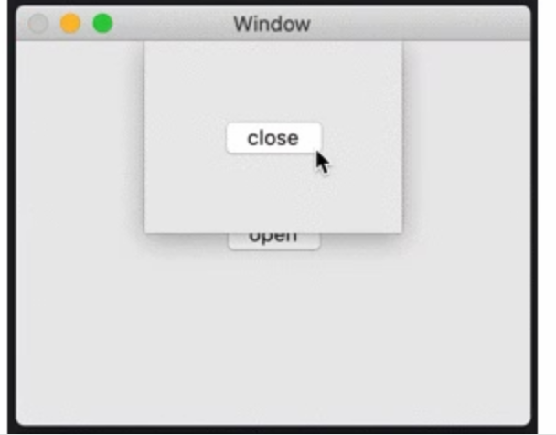

``` 
import Cocoa

class ViewController: NSViewController {

    override func viewDidLoad() {
        super.viewDidLoad()
    }

    @IBAction func openClick(_ sender: Any) {
        let sheetViewController = self.storyboard!.instantiateController(withIdentifier: "SheetViewController") as! SheetViewController
        self.presentAsSheet(sheetViewController)
    }

}
```


```
import Cocoa

class SheetViewController: NSViewController {

    override func viewDidLoad() {
        super.viewDidLoad()
        // 表示されたシートのサイズを固定にする場合
        // self.preferredContentSize = NSSize(width: 300, height: 400)
    }

    deinit {
        print("deinit")
    }

    @IBAction func closeClick(_ sender: Any) {
        self.presentingViewController?.dismiss(self)

        // こっちだと何故か deinit されず。。。
        // 呼び出し元のViewControllerでdismissしないと駄目ってことかな。。。
        // self.dismiss(self)

        // これはOK。理由は後で調べようかな。。。
        // self.dismiss(nil)
    }

}
```


