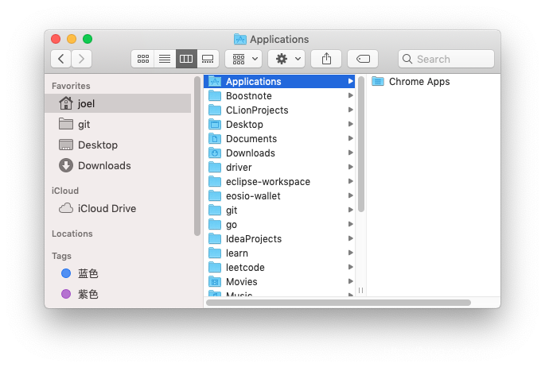

https://blog.csdn.net/joelcat/article/details/107320728
https://stackoverflow.com/questions/63094016/big-sur-outline-view-expandable-items-broken

```
import Cocoa

// Sample Node class covering groups & regular items
class Node {
    let id: Int
    let title: String
    let symbolName: String?
    let children: [Node]
    let isGroup: Bool
    
    init(id: Int, title: String, symbolName: String? = nil, children: [Node] = [], isGroup: Bool = false) {
        self.id = id
        self.title = title
        self.symbolName = symbolName
        self.children = children
        self.isGroup = isGroup
    }
    
    convenience init(groupId: Int, title: String, children: [Node]) {
        self.init(id: groupId, title: title, children: children, isGroup: true)
    }
}

extension Node {
    var cellIdentifier: NSUserInterfaceItemIdentifier {
        // These must match identifiers in Main.storyboard
        NSUserInterfaceItemIdentifier(rawValue: isGroup ? "GroupCell" : "DataCell")
    }
}

extension Array where Self.Element == Node {
    // Search for a node (recursively) until a matching element is found
    func firstNode(where predicate: (Element) throws -> Bool) rethrows -> Element? {
        for element in self {
            if try predicate(element) {
                return element
            }
            if let matched = try element.children.firstNode(where: predicate) {
                return matched
            }
        }
        return nil
    }
}

class ViewController: NSViewController, NSOutlineViewDelegate, NSOutlineViewDataSource {
    @IBOutlet var outlineView: NSOutlineView!
    
    let data = [
        Node(groupId: 1, title: "Favorites", children: [
            Node(id: 11, title: "AirDrop", symbolName: "wifi"),
            Node(id: 12, title: "Recents", symbolName: "clock"),
            Node(id: 13, title: "Applications", symbolName: "hammer")
        ]),
        Node(groupId: 2, title: "iCloud", children: [
            Node(id: 21, title: "iCloud Drive", symbolName: "icloud"),
            Node(id: 22, title: "Documents", symbolName: "doc", children: [
                Node(id: 221, title: "Work", symbolName: "folder"),
                Node(id: 221, title: "Personal", symbolName: "folder.badge.person.crop"),
            ])
        ]),
    ]
    
    override func viewWillAppear() {
        super.viewWillAppear()
        
        // Expanded items are saved in the UserDefaults under the key:
        //
        // "NSOutlineView Items \(autosaveName)"
        //
        // By default, this value is not present. When you expand some nodes,
        // an array with persistent objects is saved. When you collapse all nodes,
        // the array is removed from the user defaults (not an empty array,
        // but back to nil = removed).
        //
        // IOW there's no way to check if user already saw this source list,
        // modified expansion state, etc. We will use custom key for this
        // purpose, so we can expand group nodes (top level) when the source
        // list is displayed for the first time.
        //
        // Next time, we wont expand anything and will honor autosaved expanded
        // items.
        if UserDefaults.standard.object(forKey: "FinderLikeSidebarAppeared") == nil {
            data.forEach {
                outlineView.expandItem($0)
            }
            UserDefaults.standard.set(true, forKey: "FinderLikeSidebarAppeared")
        }
    }
    
    // Number of children or groups (item == nil)
    func outlineView(_ outlineView: NSOutlineView, numberOfChildrenOfItem item: Any?) -> Int {
        item == nil ? data.count : (item as! Node).children.count
    }
    
    // Child of a node or group (item == nil)
    func outlineView(_ outlineView: NSOutlineView, child index: Int, ofItem item: Any?) -> Any {
        item == nil ? data[index] : (item as! Node).children[index]
    }
    
    // View for our node
    func outlineView(_ outlineView: NSOutlineView, viewFor tableColumn: NSTableColumn?, item: Any) -> NSView? {
        guard let node = item as? Node,
              let cell = outlineView.makeView(withIdentifier: node.cellIdentifier, owner: self) as? NSTableCellView else {
            return nil
        }
        
        cell.textField?.stringValue = node.title
        
        if !node.isGroup {
            cell.imageView?.image = NSImage(systemSymbolName: node.symbolName ?? "folder", accessibilityDescription: nil)
        }
        
        return cell
    }

    // Mark top level items as group items
    func outlineView(_ outlineView: NSOutlineView, isGroupItem item: Any) -> Bool {
        (item as! Node).isGroup
    }
    
    // Every node is expandable if it has children
    func outlineView(_ outlineView: NSOutlineView, isItemExpandable item: Any) -> Bool {
        !(item as! Node).children.isEmpty
    }
    
    // Top level items (group items) are not selectable
    func outlineView(_ outlineView: NSOutlineView, shouldSelectItem item: Any) -> Bool {
        !(item as! Node).isGroup
    }
    
    // Object to save in the user defaults (NSOutlineView Items FinderLikeSidebar)
    func outlineView(_ outlineView: NSOutlineView, persistentObjectForItem item: Any?) -> Any? {
        (item as! Node).id
    }
    
    // Find an item from the saved object (NSOutlineView Items FinderLikeSidebar)
    func outlineView(_ outlineView: NSOutlineView, itemForPersistentObject object: Any) -> Any? {
        guard let id = object as? Int else { return nil }
        return data.firstNode { $0.id == id }
    }
}


```