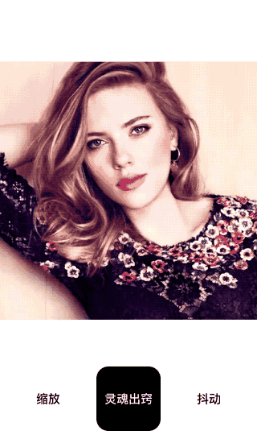

# 灵魂出窍特效  

「灵魂出窍」看上去是两个层的叠加，并且上面的那层随着时间的推移，会逐渐放大且不透明度逐渐降低。这里也用到了放大的效果，我们这次用片段着色器来实现。


## 预览
 


## GLSL (fragment shader) 

```c++ 

precision highp float;

uniform sampler2D Texture;
varying vec2 TextureCoordsVarying;

uniform float Time;

void main (void) {
    float duration = 0.7;
    float maxAlpha = 0.4;
    float maxScale = 1.8;

    float progress = mod(Time, duration) / duration; // 0~1
    float alpha = maxAlpha * (1.0 - progress);
    float scale = 1.0 + (maxScale - 1.0) * progress;

    //将顶点坐标对应的纹理坐标的 x 值到纹理中点的距离，缩小一定的比例
    float weakX = 0.5 + (TextureCoordsVarying.x - 0.5) / scale;
    float weakY = 0.5 + (TextureCoordsVarying.y - 0.5) / scale;
    vec2 weakTextureCoords = vec2(weakX, weakY);

    // 两个纹理颜色值 weakMask 和 mask, weakMask 是在 mask 的基础上做了放大处理
    vec4 weakMask = texture2D(Texture, weakTextureCoords);

    // 原始的
    vec4 mask = texture2D(Texture, TextureCoordsVarying);

    // 最终色 = 基色 * a% + 混合色 * (1 - a%) 
    gl_FragColor = mask * (1.0 - alpha) + weakMask * alpha;
}


```


## 参考 
* [ 混合模式中的正常模式 ](https://link.zhihu.com/?target=https%3A//baike.baidu.com/item/%25E6%25B7%25B7%25E5%2590%2588%25E6%25A8%25A1%25E5%25BC%258F/6700481)