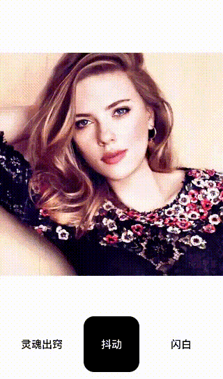

# 抖动 


「抖动」是很经典的抖音的颜色偏移效果，其实这个效果实现起来还挺简单的。另外，除了颜色偏移，可以看到还有微弱的放大效果。

## 预览 
 


## GLSL(fragment shader) 


```c++

precision highp float;

uniform sampler2D Texture;
varying vec2 TextureCoordsVarying;

uniform float Time;

void main (void) {
    float duration = 0.7;
    float maxScale = 1.1;
    float offset = 0.02;

    float progress = mod(Time, duration) / duration; // 0~1
    vec2 offsetCoords = vec2(offset, offset) * progress;
    float scale = 1.0 + (maxScale - 1.0) * progress;

    vec2 ScaleTextureCoords = vec2(0.5, 0.5) + (TextureCoordsVarying - vec2(0.5, 0.5)) / scale;


    vec4 maskR = texture2D(Texture, ScaleTextureCoords + offsetCoords);
    vec4 maskB = texture2D(Texture, ScaleTextureCoords - offsetCoords);
    vec4 mask = texture2D(Texture, ScaleTextureCoords);

    gl_FragColor = vec4(maskR.r, mask.g, maskB.b, mask.a);
}

```

> 说明 

颜色偏移是对三个颜色通道进行分离，并且给红色通道和蓝色通道添加了不同的位置偏移，代码很容易看懂。