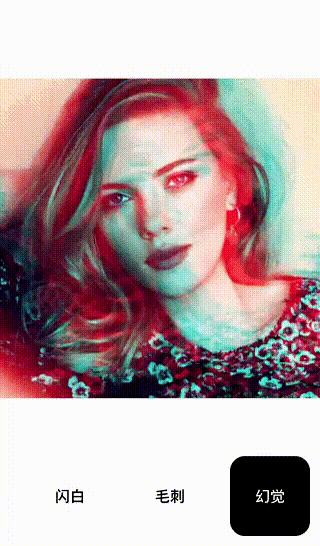

# 幻觉 

__此处和视频实现不同__  

这个效果是__残影__和__颜色偏移__的叠加。 

残影的效果还好，在移动的过程中，每经过一段时间间隔，根据当前的位置去创建一个新层，并且新层的不透明度随着时间逐渐减弱。于是在一个移动周期内，可以看到很多透明度不同的层叠加在一起，从而形成残影的效果。

然后是这个颜色偏移。我们可以看到，物体移动的过程是蓝色在前面，红色在后面。所以整个过程可以理解成：在移动的过程中，每间隔一段时间，遗失了一部分红色通道的值在原来的位置，并且这部分红色通道的值，随着时间偏移，会逐渐恢复。

## 预览 



## GLSL(fragment shader) 

```c++
precision highp float;

uniform sampler2D Texture;
varying vec2 TextureCoordsVarying;

uniform float Time;

const float PI = 3.1415926;
const float duration = 2.0;

vec4 getMask(float time, vec2 textureCoords, float padding) {
    vec2 translation = vec2(sin(time * (PI * 2.0 / duration)),
                            cos(time * (PI * 2.0 / duration)));
    vec2 translationTextureCoords = textureCoords + padding * translation;
    vec4 mask = texture2D(Texture, translationTextureCoords);
    
    return mask;
}

float maskAlphaProgress(float currentTime, float hideTime, float startTime) {
    float time = mod(duration + currentTime - startTime, duration);
    return min(time, hideTime);
}

void main (void) {
    float time = mod(Time, duration);
    
    float scale = 1.2;
    float padding = 0.5 * (1.0 - 1.0 / scale);
    vec2 textureCoords = vec2(0.5, 0.5) + (TextureCoordsVarying - vec2(0.5, 0.5)) / scale;
    
    float hideTime = 0.9;
    float timeGap = 0.2;
    
    float maxAlphaR = 0.5; // max R
    float maxAlphaG = 0.05; // max G
    float maxAlphaB = 0.05; // max B
    
    vec4 mask = getMask(time, textureCoords, padding);
    float alphaR = 1.0; // R
    float alphaG = 1.0; // G
    float alphaB = 1.0; // B
    
    vec4 resultMask = vec4(0, 0, 0, 0);
    
    for (float f = 0.0; f < duration; f += timeGap) {
        float tmpTime = f;
        vec4 tmpMask = getMask(tmpTime, textureCoords, padding);
        float tmpAlphaR = maxAlphaR - maxAlphaR * maskAlphaProgress(time, hideTime, tmpTime) / hideTime;
        float tmpAlphaG = maxAlphaG - maxAlphaG * maskAlphaProgress(time, hideTime, tmpTime) / hideTime;
        float tmpAlphaB = maxAlphaB - maxAlphaB * maskAlphaProgress(time, hideTime, tmpTime) / hideTime;
     
        resultMask += vec4(tmpMask.r * tmpAlphaR,
                           tmpMask.g * tmpAlphaG,
                           tmpMask.b * tmpAlphaB,
                           1.0);
        alphaR -= tmpAlphaR;
        alphaG -= tmpAlphaG;
        alphaB -= tmpAlphaB;
    }
    resultMask += vec4(mask.r * alphaR, mask.g * alphaG, mask.b * alphaB, 1.0);

    gl_FragColor = resultMask;
}


```


> 说明

1. 为了实现残影，我们先让图片随时间做圆周运动。  
`vec4 getMask(float time, vec2 textureCoords, float padding)` 这个函数可以计算出，在某个时刻图片的具体位置。通过它我们可以每经过一段时间，去生成一个新的层。

`float maskAlphaProgress(float currentTime, float hideTime, float startTime)` 这个函数可以计算出，某个时刻创建的层，在当前时刻的透明度。

maxAlphaR 、 maxAlphaG 、 maxAlphaB 分别指定了新层初始的三个颜色通道的透明度。因为最终的效果是残留红色，所以主要保留了红色通道的值。

然后是叠加，和两层叠加的情况类似，这里通过 for 循环来累加每一层的每个通道乘上自身的透明度的值，算出最终的颜色值 resultMask 。