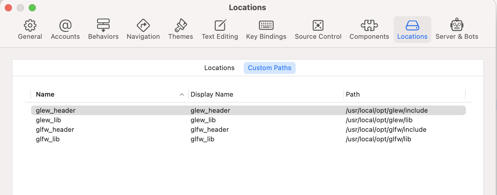

## 项目配置  

### 安装第三方库
1. brew install glfw 
2. brew install glew 

### 设置xcode 变量 
 

### Xcode 项目配置 
1. 设置header search path  
    `$(glew_header)`
    `$(glfw_header)` 
2. 设置 library search path 
    `$(glew_lib)`
    `$(glfw_lib)` 
3. 设置项目 
    删除  Hardened Runtime 
    否则会报 `dylib not found path`

4. 设置 
    Enable Modules(C and Objective-C = false， 否则 GLEW 头文件报错 

    

