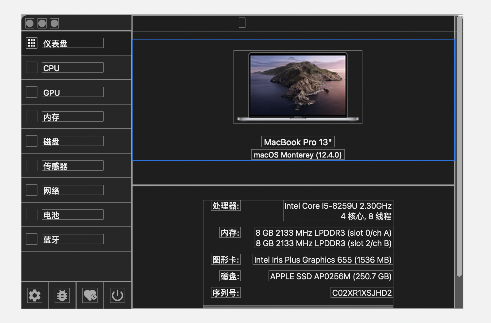

# Stats 
系统性能检测软件。 包含： 
cpu,gpu,内存，磁盘，传感器，网络， 电池，蓝牙等功能性能检测 

__以模块化的概念存在__  

## 整体介绍
1. 

## 详细模块分析 
* [cpu]()
* [gpu]()
* [RAM]()
* [Disk]()
* [Sensors(传感器)]()
* [Network]()
* [Battery]()
* [Bluetooth]()