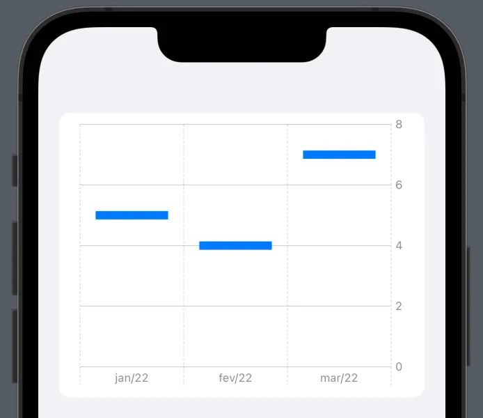

# Chart

## 参考
https://www.wwdcnotes.com/notes/wwdc22/10137/
https://blog.logrocket.com/building-custom-charts-swiftui/


> 三要素： `Chart`、`Marks`, `PlottableValues`


## 默认支持标记 
* BarMark
* PointMark
* LineMark
* AreaMark
* RuleMark
* RectangleMark 

> 支持自定义 


## 数据类型
* Quantitative
* Nominal
* Temporal

Chart 通过`PlottableValue` 用来标记并将数据传递给 Marks 进行绘制


## 图表中元素及对应样式
  
  


## 简单实例
1. BarMark 
```swift
struct ChartsExample: View {
    var body: some View {
        List {
            Chart {
                BarMark(
                    x: .value("Mount", "jan/22"),
                    y: .value("Value", 5)
                )
                BarMark(
                    x: .value("Mount", "fev/22"),
                    y: .value("Value", 4)
                )
                BarMark(
                    x: .value("Mount", "mar/22"),
                    y: .value("Value", 7)
                )
            }
            .frame(height: 250)
        }
    }
}
```
  


2. LineMark 
```swift 
struct ChartsExample: View {
    var body: some View {
        List {
            Chart {
                LineMark(
                    x: .value("Mount", "jan/22"),
                    y: .value("Value", 5)
                )
                LineMark(
                    x: .value("Mount", "fev/22"),
                    y: .value("Value", 4)
                )
                LineMark(
                    x: .value("Mount", "mar/22"),
                    y: .value("Value", 7)
                )
            }
            .frame(height: 250)
        }
    }
}
```
  


3. PointBar 
```swift 
struct ChartsExample: View {
    var body: some View {
        List {
            Chart {
                PointMark(
                    x: .value("Mount", "jan/22"),
                    y: .value("Value", 5)
                )
                PointMark(
                    x: .value("Mount", "fev/22"),
                    y: .value("Value", 4)
                )
                PointMark(
                    x: .value("Mount", "mar/22"),
                    y: .value("Value", 7)
                )
            }
            .frame(height: 250)
        }
    }
}

```
  


4. AreaMark 
```swift 
struct ChartsExample: View {
    var body: some View {
        List {
            Chart {
                AreaMark(
                    x: .value("Mount", "jan/22"),
                    y: .value("Value", 5)
                )
                AreaMark(
                    x: .value("Mount", "fev/22"),
                    y: .value("Value", 4)
                )
                AreaMark(
                    x: .value("Mount", "mar/22"),
                    y: .value("Value", 7)
                )
            }
            .frame(height: 250)
        }
    }
}

```
  

5. RectangleMark 
```swift
struct ChartsExample: View {
    var body: some View {
        List {
            Chart {
                RectangleMark(
                    x: .value("Mount", "jan/22"),
                    y: .value("Value", 5)
                )
                RectangleMark(
                    x: .value("Mount", "fev/22"),
                    y: .value("Value", 4)
                )
                RectangleMark(
                    x: .value("Mount", "mar/22"),
                    y: .value("Value", 7)
                )
            }
            .frame(height: 250)
        }
    }
}

```
  


6. RuleMark
```swift 
struct ChartsExample: View {
    var body: some View {
        List {
            Chart {
                RuleMark(
                    xStart: .value("Start", 1),
                    xEnd: .value("End", 12),
                    y: .value("Value", 2.5)
                )
                RuleMark(
                    xStart: .value("Start", 9),
                    xEnd: .value("End", 16),
                    y: .value("Value", 1.5)
                )
                RuleMark(
                    xStart: .value("Start", 3),
                    xEnd: .value("End", 10),
                    y: .value("Value", 0.5)
                )
            }
            .frame(height: 250)
        }
    }
}
```


## 复杂用法 
1. 结合标记创建自定义图表
```swift 

import SwiftUI
import Charts

struct MountPrice: Identifiable {
    var id = UUID()
    var mount: String
    var value: Double
}

struct ChartsExample: View {
    let data: [MountPrice] = [
        MountPrice(mount: "jan/22", value: 5),
        MountPrice(mount: "feb/22", value: 4),
        MountPrice(mount: "mar/22", value: 7),
        MountPrice(mount: "apr/22", value: 15),
        MountPrice(mount: "may/22", value: 14),
        MountPrice(mount: "jun/22", value: 27),
        MountPrice(mount: "jul/22", value: 27)
    ]
        
    var body: some View {
        List {
            Chart(data) {
                LineMark(
                    x: .value("Mount", $0.mount),
                    y: .value("Value", $0.value)
                )
                PointMark(
                    x: .value("Mount", $0.mount),
                    y: .value("Value", $0.value)
                )
            }
            .frame(height: 250)
        }
    }
}

```
  


2. 合并多个数据类别 
> 主要通过`foregroundStyle(by:)` 给个不同的key，value指定不同类别 `.chartForegroundStyleScale(["Green": .green, "Purple": .purple, "Pink": .pink, "Yellow": .yellow])`通过此方法，根据key，自定义不同的颜色 

```swift 
struct MountPrice: Identifiable {
    var id = UUID()
    var mount: String
    var value: Double
    var type: String
}

struct ChartsExample: View {
    let data: [MountPrice] = [
        MountPrice(mount: "jan/22", value: 5, type: "A"),
        MountPrice(mount: "feb/22", value: 4, type: "A"),
        MountPrice(mount: "mar/22", value: 7, type: "A"),
        MountPrice(mount: "apr/22", value: 15, type: "A"),
        MountPrice(mount: "may/22", value: 14, type: "A"),
        MountPrice(mount: "jun/22", value: 27, type: "A"),
        MountPrice(mount: "jul/22", value: 27, type: "A"),
        
        MountPrice(mount: "jan/22", value: 15, type: "B"),
        MountPrice(mount: "feb/22", value: 14, type: "B"),
        MountPrice(mount: "mar/22", value: 17, type: "B"),
        MountPrice(mount: "apr/22", value: 25, type: "B"),
        MountPrice(mount: "may/22", value: 24, type: "B"),
        MountPrice(mount: "jun/22", value: 37, type: "B"),
        MountPrice(mount: "jul/22", value: 49, type: "B")
    ]
        
    var body: some View {
        List {
            Chart {
                ForEach(data) {
                    AreaMark(
                        x: .value("Mount", $0.mount),
                        y: .value("Value", $0.value)
                    )
                    .foregroundStyle(by: .value("Type", "Series \($0.type)"))
                }
            }
            .frame(height: 250)
        }
    }
}


```


