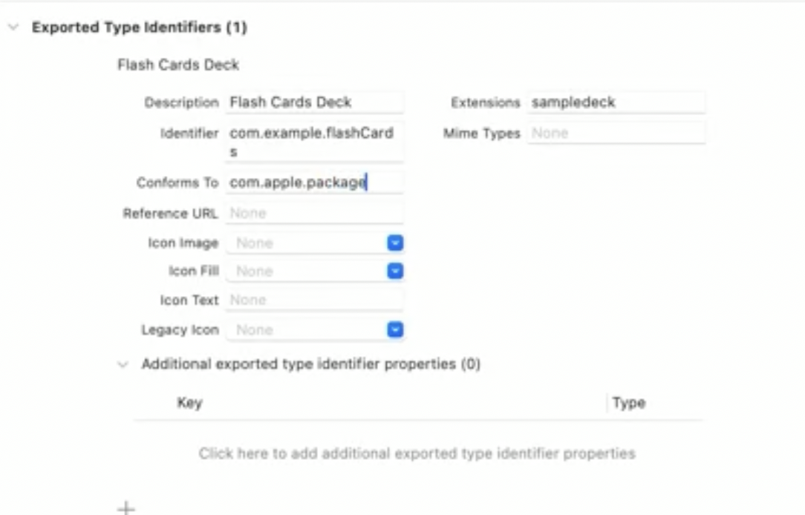

# Swift UI & SwiftData 


```swift 
// 使用 swiftUI 修饰器 初始化
 WindowGroup {
    ContentView()
}
.modelContainer(
    for: [Trip.self, LivingAccommodation.self]
)


// TODO: 获取 context 上下文
struct ContextView : View {
    @Environment(\.modelContext) private var context
}

// TODO: 查询数据
 @Query(sort: \.startDate, order: .reverse) var trips: [Trip]


```

#### 预览 
```swift 

#Preview {
    ContentView()
        .frame(minWidth: 500, minHeight: 500)
        .modelContainer(previewContainer)
}
```


#### 基于文档应用 
```swift 

@main
struct SwiftDataFlashCardSample: App {
    var body: some Scene {
        #if os(iOS) || os(macOS)
        // flashCards 文件类型
        DocumentGroup(editing: Card.self, contentType: .flashCards) {
            ContentView()
        }
        #else
        WindowGroup {
            ContentView()
                .modelContainer(for: Card.self)
        }
        #endif
    }
}

extension UTType {
    static var flashCards = UTType(exportedAs: "com.example.flashCards")
}

// 修改 info.plist 文件 
// Exported Type Identifier 
// extensions "sanmpledack"
// identifier "com.example.flashCards"
// conforms To "com.apple.package"
```

  


## 重点& 总结 
1. `@Model` 符合 `Observable`协议  
2. 双向绑定引用类型`@Bindable` 
    `@Bindable var card: Card`  
3. 预览带有数据样本 
    ```swift 
        #Preview {
            ContentView()
                .frame(minWidth: 500, minHeight: 500)
                .modelContainer(previewContainer)
        }
    ```
4. 可以不用掉用`save()`方法， swiftdata 回自动保存上下文， 由UI事件和用户输入触发的  
