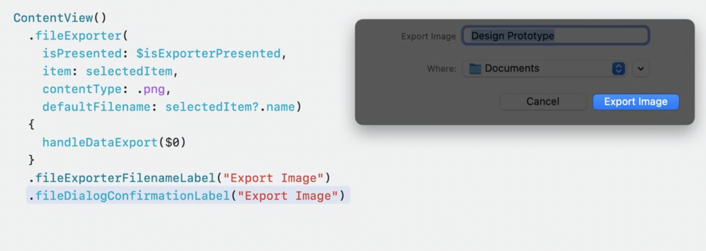
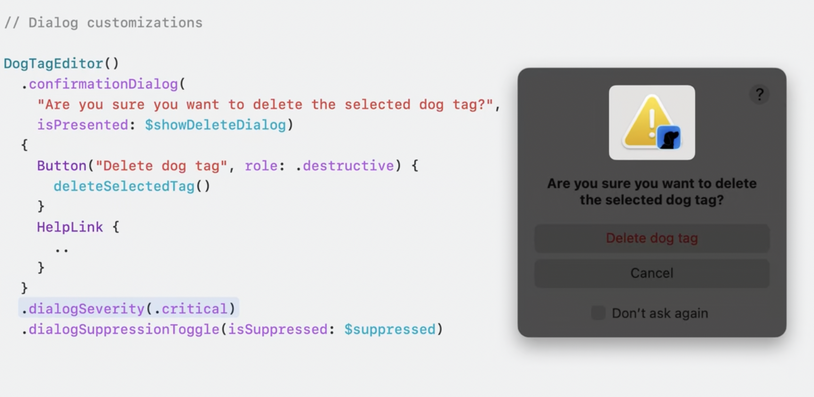

# 其他新特性 


## 3D 空间的支持 
针对 3D 空间的支持，部分控件通过属性进行更改，部分控件默认支持3D, 在针对性的平台运行采用针对的效果  
* Window Group 
```swift 
WindowGroup {


}.windowStyle(.volumetric)


```
* NavigationSplitView/ TabView 
__默认支持__  


### RealityKit 支持
* 3D model 加载 
```swift 
var body: some View {
    Model3D(named: "Earth")
}

```


## Preview 
> 可以直接预览所有UI 相关的，包括 swiftUI， UIKit, Cocoa 
```swift 
class LibraryViewController: UIViewController {
    // ...
}

#Preview("Library") {
    let controller = LibraryViewController()
    controller.displayCuratedContent = true
    return controller
}

```


## MapKit 


## Charts

### Scrolling Charts
```swift 
Chart {
    ForEach(SalesData.last365Days, id: \.day) {
        BarMark(
            x: .value("Day", $0.day, unit: .day),
            y: .value("Sales", $0.sales))
    }
    .foregroundStyle(.blue)
}
.chartScrollableAxes(.horizontal)
.chartXVisibleDomain(length: 3600 * 24 * 30)
.chartScrollPosition(x: $scrollPosition)
.chartXSelection(value: $selection)

struct SalesData: Plottable {
    var day: Date
    var sales: Int

    var primitivePlottable: Date { day }

    init?(primitivePlottable: Date) {
        self.day = primitivePlottable
        self.sales = 0
    }

    init(day: Date, sales: Int) {
        self.day = day
        self.sales = sales
    }

    static let last365Days: [SalesData] = buildSalesData()

    private static func buildSalesData() -> [SalesData] {
        var result: [SalesData] = []
        var date = Date.now
        for _ in 0..<365 {
            result.append(SalesData(day: date, sales: Int.random(in: 150...250)))
            date = Calendar.current.date(
                byAdding: .day, value: -1, to: date)!
        }
        return result.reversed()
    }
}


```

### Donut and Pie Charts 
```swift 

import SwiftUI
import Charts

struct DonutChart_Snippet: View {
    var sales = Bagel.salesData

    var body: some View {
        NavigationStack {
            Chart(sales, id: \.name) { element in
                SectorMark(
                    angle: .value("Sales", element.sales),
                    innerRadius: .ratio(0.6),
                    angularInset: 1.5)
                .cornerRadius(5)
                .foregroundStyle(by: .value("Name", element.name))
            }
            .padding()
            .navigationTitle("Bagel Sales")
            .toolbarTitleDisplayMode(.inlineLarge)
        }
    }
}

struct Bagel {
    var name: String
    var sales: Int

    static var salesData: [Bagel] = buildSalesData()

    static func buildSalesData() -> [Bagel] {
        [
            Bagel(name: "Blueberry", sales: 60),
            Bagel(name: "Everything", sales: 120),
            Bagel(name: "Choc. Chip", sales: 40),
            Bagel(name: "Cin. Raisin", sales: 100),
            Bagel(name: "Plain", sales: 140),
            Bagel(name: "Onion", sales: 70),
            Bagel(name: "Sesame Seed", sales: 110),
        ]
    }
}

#Preview {
    DonutChart_Snippet()
}


```


## Inspector  


## File Export Dialog Customization 
  
```swift 
import Foundation
import SwiftUI
import UniformTypeIdentifiers

struct ExportDialogCustomization: View {
    @State private var isExporterPresented = true
    @State private var selectedItem = ""
    
    var body: some View {
        Color.clear
            .fileExporter(
                isPresented: $isExporterPresented, item: selectedItem,
                contentTypes: [.plainText], defaultFilename: "ExportedData.txt")
            { result in
                handleDataExport(result: result)
            }
            .fileExporterFilenameLabel("Export Data")
            .fileDialogConfirmationLabel("Export Data")
    }

    func handleDataExport(result: Result<URL, Error>) {
    }

    struct Data: Codable, Transferable {
        static var transferRepresentation: some TransferRepresentation {
            CodableRepresentation(contentType: .plainText)
        }

        var text = "Exported Data"
    }
}
```


## Confirmation Dialog Customization 
  
```swift 
import Foundation
import SwiftUI
import UniformTypeIdentifiers

struct ConfirmationDialogCustomization: View {
    @State private var showDeleteDialog = false
    @AppStorage("dialogIsSuppressed") private var dialogIsSuppressed = false

    var body: some View {
        Button("Show Dialog") {
            if !dialogIsSuppressed {
                showDeleteDialog = true
            }
        }
        .confirmationDialog(
            "Are you sure you want to delete the selected dog tag?",
            isPresented: $showDeleteDialog)
        {
            Button("Delete dog tag", role: .destructive) { }

            HelpLink { }
        }
        .dialogSeverity(.critical)
        .dialogSuppressionToggle(isSuppressed: $dialogIsSuppressed)
    }
}
```


## TableView 
### Table Column Customization 
```swift 
import SwiftUI

struct DogSightingsTable: View {
    private var dogSightings: [DogSighting] = (1..<50).map {
        .init(
            name: "Sighting \($0)",
            date: .now + Double((Int.random(in: -5..<5) * 86400)))
    }

    @SceneStorage("columnCustomization")
    private var columnCustomization: TableColumnCustomization<DogSighting>
    @State private var selectedSighting: DogSighting.ID?
    
    var body: some View {
        Table(
            dogSightings, selection: $selectedSighting,
            columnCustomization: $columnCustomization)
        {
            TableColumn("Dog Name", value: \.name)
                .customizationID("name")
            
            TableColumn("Date") {
                Text($0.date, style: .date)
            }
            .customizationID("date")
        }
    }
    
    struct DogSighting: Identifiable {
        var id = UUID()
        var name: String
        var date: Date
    }
}


```


### DisclosureTableRow 
```swift 
import SwiftUI

struct DogGenealogyTable: View {
    private static let dogToys = ["🦴", "🧸", "👟", "🎾", "🥏"]

    private var dogs: [DogGenealogy] = (1..<10).map {
        .init(
            name: "Parent \($0)", age: Int.random(in: 8..<12) * 7,
            favoriteToy: dogToys[Int.random(in: 0..<5)],
            children: (1..<10).map {
                .init(
                    name: "Child \($0)", age: Int.random(in: 1..<5) * 7,
                    favoriteToy: dogToys[Int.random(in: 0..<5)])
            }
        )
    }

    var body: some View {
        Table(of: DogGenealogy.self) {
            TableColumn("Dog Name", value: \.name)
            TableColumn("Age (Dog Years)") {
                Text($0.age, format: .number)
            }
            TableColumn("Favorite Toy", value: \.favoriteToy)
        } rows: {
            ForEach(dogs) { dog in
                DisclosureTableRow(dog) {
                    ForEach(dog.children) { child in
                        TableRow(child)
                    }
                }
            }
        }
    }

    struct DogGenealogy: Identifiable {
        var id = UUID()
        var name: String
        var age: Int
        var favoriteToy: String
        var children: [DogGenealogy] = []
    }
}


```

