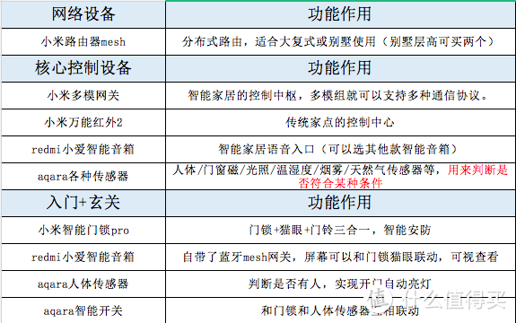
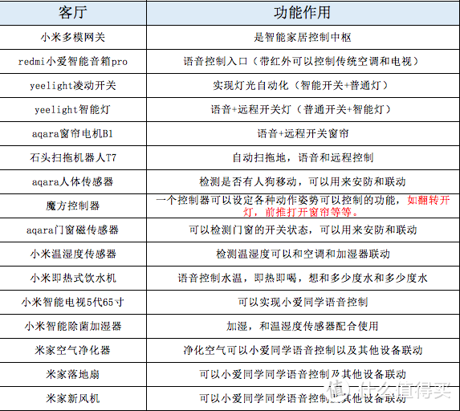
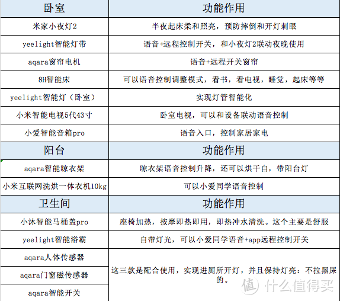
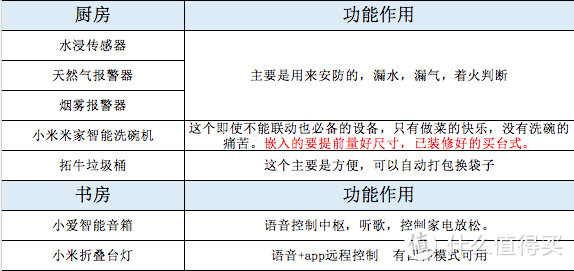
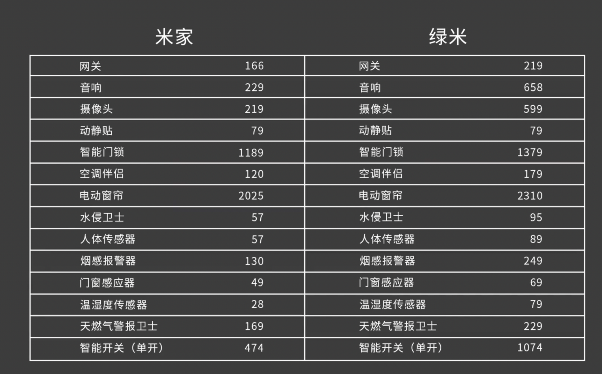

=============================
# 需要购买的设备
人体感应器 			3～4个
空调伴侣 				3个
摄像头				2个
温湿度传感器 			1个
网关					2个
智能开关				若干	
门窗磁传感器			2个

红外遥控版本： 控制传统的家电

=============================
# 网关中枢
home mini/ apple tv

=============================
# 支持home kit 的企业设备
* 绿米
* 小燕科技 
* 智汀
* yeelight 灯

matter 协议。

=============================== 
# 可能用不到的东西
* 烟雾、水侵、天然气传感器 
* 光照传感器 

===============================
# 参考文章 
https://post.smzdm.com/p/ad2r8pdx/

===============================
# 路由选择 
* 单路由 
* mesh 方案 
* AC+AP 主机+ 子路由方案

===============================
蜗牛星际---黑群晖 

灯光，电视，空调，晾衣架，洗衣机，扫地机器人，窗帘，床等等。

