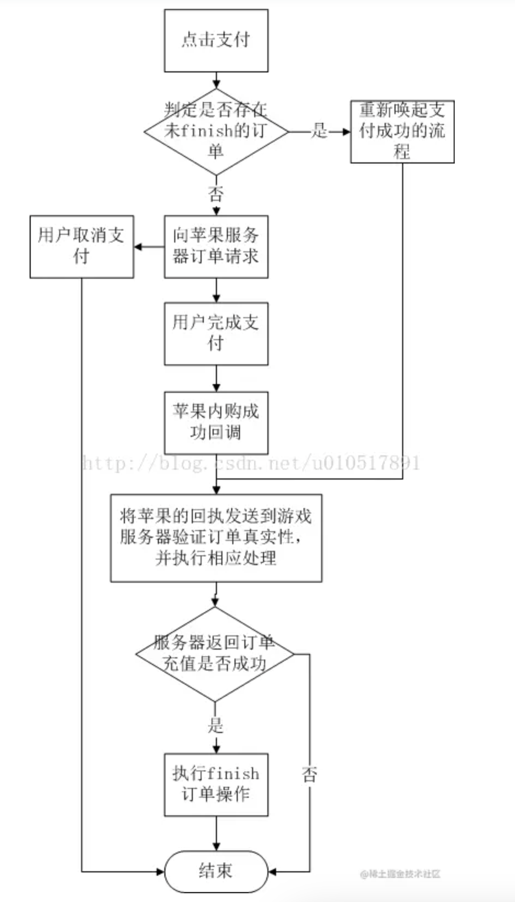

# iOS 内购 

## framework 
[Mercato](https://github.com/tikhop/Mercato)


## 账号准备  
1. AppStore Connect里协议、税务和银行业务。  
    [参考](https://www.yimenapp.com/info/apple-ping-guo-IOS-nei-gou-shen-qing-jiao-cheng-xie-yi-%E3%80%81-shui-wu-he-yin-hang-ye-wu-pei-zhi-464.html)  

2. 添加内购项目
    1. apple connect 中找到对应项目 
    2. App 内购买项目----> 创建
        * 填写类型， 产品ID，参考名称 
    3. 添加 销售范围 
    4. 添加价格表 
    5. 添加 App Store 本地化版本  
    6. __添加审核信息__ 
        * 购买页面截图，__要截取内购弹窗的图片__  
            
        * 审核备注, __必须要有沙盒账户(测试内购的账户)__  

> 1. 内购项目添加之后没审核过依然可以获取到信息，并且可以用沙盒账号测试购买
> 2. 第一版应用也是可以添加内购的，在提交app审核时同时提交内购项目审核  

3. 添加沙盒测试员 
    * 进入用户和访问 
    * 沙箱技术----> 测试员 


## 内购交互 

1. 获取内购信息，更新UI，添加内购商品
2. 购买完成后拿到购买凭据 
3. 将购买凭证传给后台（同时传递一些自定义的业务参数）
4. 后台去验证购买结果
5. 苹果服务器将购买结果给到后台  
6. 后台将购买结果给到App


## 内购类型 
1. 消耗型商品: 只可使用一次的产品，使用之后即失效，必须再次购买 
2. 非消耗型商品: 只需购买一次，不会过期或随着使用而减少的产品  
3. 自动续期订阅: 允许用户在固定时间段内购买动态内容的产品。除非用户选择取消，否则此类订阅会自动续期。  
4. 非续期订阅: 允许用户购买有时限性服务的产品。此 App 内购买项目的内容可以是静态的。此类订阅不会自动续期。 示例：为期一年的已归档文章目录订阅。


### 自动续期订阅 
1. 订阅群组  
    * 以向用户提供一系列内容供应、服务等级或时限 
    * 名字可以自己随便起，就是给自己看的，有代表意义就行 
    * 一个群组下可以有多个自动续订订阅 
    * 促销优惠时，每个顾客可以享受每个订阅群组的一个推介促销优惠一次。
    * 一个订阅群组中的订阅是 __互斥__ 的, 如果你希望用户能够一次购买多个订阅，你可以将这些 App 内购买项目放在不同的订阅群组中。

2. 订阅状态 URL  
    * 在 App 信息 里配置  
    * 用于后台收到 server to server 的通知  


3. 推介促销优惠  
    * 随用随付
        顾客将按选定时限的每个结算周期支付折扣价格（例如，订阅的标准价格为 9.99 美元，折扣价为前 3 个月每月 1.99 美元）。
    * 提前支付
        顾客将一次性支付选定时限的折扣价格（例如，订阅的标准价格为 9.99 美元，折扣价为前 2 个月 1.99 美元）。
    * 免费 
        顾客在选定的时限内免费访问订阅。时限可以是 3 天、1 周、2 周、1 个月、2 个月、3 个月、6 个月或 1 年。一个月的免费试用在 28 到 31 天不等。

> 1. 顾客可以享受每个订阅群组的一个推介促销优惠
> 2. 您可以针对每个地区设置一个当前推介促销优惠和一个未来推介促销优惠
> 3. 您可以针对每个地区设置一个当前推介促销优惠和一个未来推介促销优惠
> 4. 如果您已推广您的 App 内购买项目，推介促销优惠将显示在您的 App Store 产品页上
> 5. 推介促销优惠适用于运行 iOS 10、Apple TVOS 10 和 macOS 10.12.6 及更高版本的顾客  


## 内购流程 
 


## 具体代码实现
1. app开始运行时，添加监听(__自动订阅类型必须添加__)  
```objective-c
[[SKPaymentQueue defaultQueue] addTransactionObserver:self]; 
```
> 因为自动订阅类型，除了第一次购买行为是用户主动触发的。后续续费都是 Apple 自动完成的，一般在要过期的前 24 小时开始，苹果会尝试扣费，扣费成功的话会在 APP 下次启动的时候主动推送给 APP。所以，APP 启动的时候一定要添加上面的那句话。  
2. 订单结束后一定要执行 finishTransaction 操作 
```objective-c
[[SKPaymentQueue defaultQueue] finishTransaction:transaction];
```

3. 调起支付，请求商品信息
```objective-c
/**
 调起支付，请求商品信息
 @param productId 商品Id（在苹果connect上配置的内购地址）
 */
- (void)payWithAppleProductID:(NSString *)productId {
    
    if ([SKPaymentQueue canMakePayments]) {
        // 如果允许应用内付费购买
        // 把商品ID信息放入一个集合中
        NSArray *productIdentifiers = [[NSArray alloc] initWithObjects: productId, nil];
        NSSet * set = [NSSet setWithArray:productIdentifiers];
        // 请求内购商品信息，只返回你请求的产品（主要用于验证商品的有效性）
        SKProductsRequest * request = [[SKProductsRequest alloc] initWithProductIdentifiers:set];
        request.delegate = self;
        [request start];
        
    } else {
        // 如果用户手机禁止应用内付费购买.
        // 则弹出开启购买权限开关的提示等...
    }
}

#pragma mark - SKProductRequestDelegate 
/**
 收到产品返回信息
 SKProductsRequest是苹果封装好的一个对象，该对象有两个属性。
 products是一个数组，代表的是你获取到的所有商品信息，每个商品  都是一个数组元素。
 invalidProductIdentifiers是无效的商品id的数组，此id对应的是你在苹果后台构建的商品id。
 */
- (void)productsRequest:(SKProductsRequest *)request didReceiveResponse:(SKProductsResponse *)response{

    NSLog(@"--------------收到产品反馈消息---------------------");
    NSArray *product = response.products;
    if([product count] == 0){
        [SVProgressHUD dismiss];
        NSLog(@"--------------没有商品------------------");
        return;
    }

    NSLog(@"productID:%@", response.invalidProductIdentifiers);
    NSLog(@"产品付费数量:%lu",(unsigned long)[product count]);

    SKProduct *requestProduct = nil;
    for (SKProduct *pro in product) {
        NSLog(@"%@", [pro description]);
        NSLog(@"%@", [pro localizedTitle]);
        NSLog(@"%@", [pro localizedDescription]);
        NSLog(@"%@", [pro price]);
        NSLog(@"%@", [pro productIdentifier]);
        // 如果后台消费条目的ID与我这里需要请求的一样（用于确保订单的正确性）
        if([pro.productIdentifier isEqualToString:_currentProId]){
            requestProduct = pro;
        }
    }

    // 发送购买请求
    //SKPayment *payment = [SKPayment paymentWithProduct:requestProduct];// 不可变的
    SKMutablePayment *payment = [SKMutablePayment paymentWithProduct:requestProduct];// 可变的
    payment.applicationUsername = @"123456";// 发起支付时候指定用户的userId
    // 在之后收到交易回调的时候，我可以根据携带的applicationUsername 来判断当前用户是否是同一个用户，如果是同一个用户再去验证票据(此值可能为空)
    [[SKPaymentQueue defaultQueue] addPayment:payment];
}

// 请求失败
- (void)request:(SKRequest *)request didFailWithError:(NSError *)error{
    NSLog(@"------------------错误-----------------:%@", error);
}

- (void)requestDidFinish:(SKRequest *)request{
    NSLog(@"------------反馈信息结束-----------------");
}
```


4. 判断购买结果  
> 这里需要用到 SKPaymentTransactionObserver，SKPaymentTransactionObserver 是交易观察者，用来告诉你交易进行到哪个步骤了。  
```objective-c
// 13.监听购买结果
- (void)paymentQueue:(SKPaymentQueue *)queue updatedTransactions:(NSArray *)transaction {
    
    for (SKPaymentTransaction *tran in transaction){
        
        switch (tran.transactionState) {
            case SKPaymentTransactionStatePurchased:
                NSLog(@"交易完成");
                // 订阅特殊处理
                if (tran.originalTransaction) {
                    // 如果是自动续费的订单,originalTransaction会有内容
                    NSLog(@"自动续费的订单,originalTransaction = %@",tran.originalTransaction);
                } else {
                    // 普通购买，以及第一次购买自动订阅
                    NSLog(@"普通购买，以及第一次购买自动订阅");
                }
                 if ([Global sharedGlobal].loginInfo.logined) {
                    // 只有登录了才去处理票据 和 执行finish操作
                    NSString *orderUserId = [[tran payment] applicationUsername];// 得到该订单的用户Id
                    if ((orderUserId && orderUserId.length > 0 && [[Global sharedGlobal].loginInfo.userId isEqualToString:orderUserId]) || (nil == orderUserId || orderUserId.length == 0)) {
                        // 当订单的userId和当前userId一致 或者 订单userId为空时才处理票据、执行finish操作
                        [self completeTransaction:tran];
                        [[SKPaymentQueue defaultQueue] finishTransaction:tran];// 销毁本次操作，由本地数据库进行记录和恢复
                    }
                }
                break;
            case SKPaymentTransactionStatePurchasing:
                NSLog(@"商品添加进列表");
                break;
            case SKPaymentTransactionStateRestored:
                NSLog(@"已经购买过商品");
                [[SKPaymentQueue defaultQueue] finishTransaction:tran];
                break;
            case SKPaymentTransactionStateFailed:
                NSLog(@"交易失败");
                [[SKPaymentQueue defaultQueue] finishTransaction:tran];
                break;
            default:
                break;
        }
    }
}

// 交易结束,当交易结束后还要去appstore上验证支付信息是否都正确,只有所有都正确后,我们就可以给用户方法我们的虚拟物品了。
- (void)completeTransaction:(SKPaymentTransaction *)transaction {
    
    NSString * str = [[NSString alloc] initWithData:transaction.transactionReceipt encoding:NSUTF8StringEncoding];
    NSString *environment = [self environmentForReceipt:str];
    NSLog(@"----- 完成交易调用的方法completeTransaction 1--------%@",environment);
    // 验证凭据，获取到苹果返回的交易凭据
    NSURL *receiptURL = [[NSBundle mainBundle] appStoreReceiptURL];// appStoreReceiptURL iOS7.0增加的，购买交易完成后，会将凭据存放在该地址
    NSData *receiptData = [NSData dataWithContentsOfURL:receiptURL];// 从沙盒中获取到购买凭据
    NSString *encodeStr = [receiptData base64EncodedStringWithOptions:NSDataBase64EncodingEndLineWithLineFeed];// BASE64 常用的编码方案，通常用于数据传输，以及加密算法的基础算法，传输过程中能够保证数据传输的稳定性，BASE64是可以编码和解码的
    
    if (![UserOrderInfo isHasReceiptDate:encodeStr]) {
        // 如果本地数据库没有此条票据记录
        NSString *environmentStr;
        if ([environment isEqualToString:@"environment=Sandbox"]) {
            environmentStr = @"sandbox";
        } else {
            environmentStr = @"product";
        }
        // 将票据POST给自己的服务器去校验...        
    }
}
```


## 服务器验证 
> 1. 需要首先在`app 内的 app 信息` 位置，生成 专用的 `共享密钥` 
> 2. 需要首先在`app 内的 app 信息` 位置，设置 App Store 服务器通知

#### 服务器状态 

* INITIAL_BUY
    初次购买订阅。latest_receipt通过在App Store中验证，可以随时将您的服务器存储在服务器上以验证用户的订阅状态。  
* CANCEL 
    Apple客户支持取消了订阅。检查Cancellation Date以了解订阅取消的日期和时间。 
* RENEWAL
    已过期订阅的自动续订成功。检查Subscription Expiration Date以确定下一个续订日期和时间。 
* INTERACTIVE_RENEWAL
    客户通过使用应用程序界面或在App Store中的App Store中以交互方式续订订阅。服务立即可用。 
* DID_CHANGE_RENEWAL_PREF
    客户更改了在下次续订时生效的计划。当前的有效计划不受影响。


## 参考 
[iOS内购（IAP）自动续订订阅类型总结](https://juejin.cn/post/6844903924193853453)