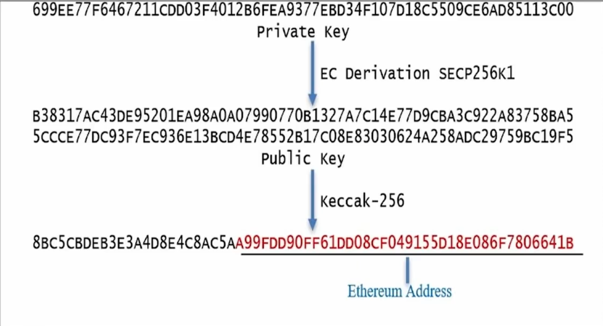
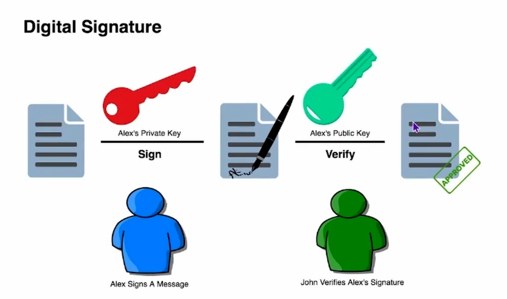
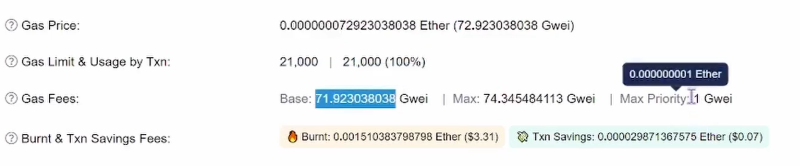

# 智能合约开发 


## 账户、私钥、公钥、地址、密码、助记词、钱包 
* 私钥： 
    钱包的加密信息， 可应用于转账时的校验 
* 公钥： 
    private key ----> SECP256-----> 公钥------> Keccak-256 -----> 钱包地址(计算后的后20个字节)  
      
      

* 地址 
    钱包地址相当于银行卡号， 包含了所有的资产和交易记录 

* 密码 
    密码是针对私钥的一个加密 

* 助记词 
    助记词是私钥根据一定的算法，生成多个单词，需要牢记，可以通过助记词恢复钱包  


## Gas --- 交易费 
  
> 说明： 
    * Gas Price: 单价
    * gas Limit : 使用量 
    * gas fees： 基础费  最大  小费 


## 网络和节点 


## 开发工具 Remix IDE 
[Remix IDE](https://remix.ethereum.org)
[Ganache]


## Solidity 
* Var
* Functions 
* Modifier  
    ```

    // import "hardhat/console.sol"; 导入文件方式

    pragma solidity >=0.7.0 <0.9.0;  


    contract ExampleModifier { 

        address public owner;       // address 创建者
        uint256 public account;     // 变量

        // 构造函数
        constructor() {
            owner = msg.sender;
            account = 0;
        }

        // modifier 修饰
        modifier onlyOwner() {
            require(msg.sender == owner, "Only Owner"); 
            _;
        }

        // 函数定义 + 使用 modifier 修饰
        function updateAccount(uint256 _account) public onlyOwner {
            account = _account;
        }

    }

    ```

* Event
    ```
    contract ExampleEvent {
        // 定义 eventt 方法
        event Deposit(address _from, string _name, uint256 _value);

        // 合约方法
        function deposit(string memory _name) public payable {
            // 将 log 日志写入到区块链中去
            emit Deposit(msg.sender, _name, msg.value);
        }

    }


    ```
* Error
* Struct Type
* Enums 


## 纯 js 登陆以太坊钱包 

