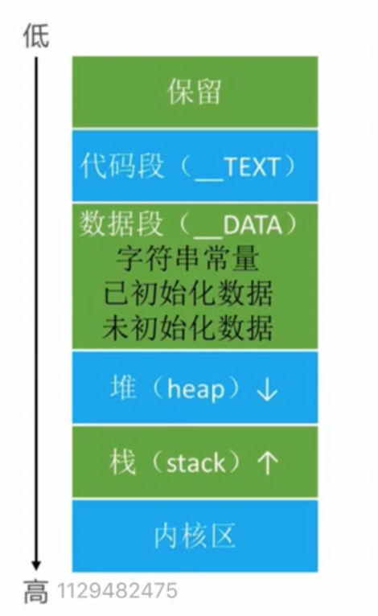

# 内存管理  

## 常见面试题  
1. 使用定时器有什么注意点？ 
2. 介绍内存的几大区域  
3. iOS内存管理理解  
4. autorelease在什么时机释放  
5. 方法中有局部对象，除了方法后会立即释放吗？ 
6. ARC都做了什么？ 
7. weak指针实现原理  


## NSTimer 循环引用问题  
1. 通过NSObject创建对应的 proxy 类  
```Objective-C 

@interface TProxy: NSObject
@property(weak, non)id target; 
@end


// 利用消息转发 
-(id)forwardingTargetForSelector:(SEL) selector {
    return target;
}

```

2. 通过 NSProxy 实现  
```Objective-C 

@interface TProxy: NSProxy
@property(weak, non)id target; 
@end

// 此类没有 init方法，不需要调用init   

+(instancetype) proxyWithTarget:(id)target {
    TProxy * p = [TProxy alloc];
    p.target = target;
    return p;
}

// 返回方法签名
-(void)methodSignatureForSelector:(SEL)sel {
    return [self.target methodSignatureForSelector:sel];
}
// 
-(void)forwardInvocation:(NSInvocation *)invocation {
    [invocation invokeWithTarget: self.target];

}

```


#### GCD 定时器  
1. 比Timer 准确  
2. 直接和系统内核挂钩，不依赖runloop  
3. 不会造成当UIScrollView 滚动时停止   


```Objectice-C 

// 队列 
dispatch_queue queue = dispatch_get_main_queue(); 

// 创建定时器 
dispatch_source_t time = dispatch_source_create(DISPATCH_SOURCE_TYPE_TIMER， 0，0，queue); 

// 这只时间 
uint64_t start = 2.0; // 2秒后开始执行
uint64_t interval = 1.0; // 间隔  

dispatch_source_set_timer(
    time,
    dispatch_time(DISPATCH_TIME_NOW, start * NSEC_PER_SEC),
    interval * NSEC_PER_sec,
    0
);

// 回调  
dispatch_source_set_event_handler(time,^{

});

// 启动定时器 
dispatch_resume(time); 
self.timer = time;
```

封装为 Timer  
```

static NSMutableDictionary *timers; 

+(void)initialize {
    dispatch_once(&onceToken, ^{
        timers = [NSMutableDictionary dictionary];
    })
}

// 返回一个唯一标识   
+(NSString *)exec:(void(^)(void))task 
    start:(NSTimerInterval) start
    interval:(NSTimerInterval) interval
    repeats:(Bool) repetas
    async:(BOOL) async 
    {

        if (!task || start < 0 || (interval <= 0 && repeats == YES)) return nil;
        // 定时器唯一标识 
        NSString *name = "dnkankda";

        // 队列 
        dispatch_queue queue = async? dispatch_get_global_queue(0,0): dispatch_get_main_queue(); 

        // 创建定时器 
        dispatch_source_t time = dispatch_source_create(DISPATCH_SOURCE_TYPE_TIMER， 0，0，queue); 


        dispatch_source_set_timer(
            time,
            dispatch_time(DISPATCH_TIME_NOW, start * NSEC_PER_SEC),
            interval * NSEC_PER_sec,
            0
        );

        // 回调  
        dispatch_source_set_event_handler(time,^{
            task();
            if(!repeats) {
                // dispatch_source_cancel(timer); 
                [self cancelTask: name];
            }
        });

        // 启动定时器 
        dispatch_resume(time);  
        timrs[name] = timer;
        return name;
    }

+(void) cancelTask:(NSString *)name {  
    if(name.length == 0)return; 
    dispatch_semaphore_wait(semaphore, ddddd);
    dispatch_source_t timer = timers[name]; 
    if (!timer) return;
    dispatch_source_cancel(timers[name]); 
    [timer];

    dispatch_semaphore_signal(semaphore);
}

```


## 内存分布  
### iOS程序内存分布  
  
* 代码段： 编译之后的代码  
* 数据段  
    * 字符串常亮  
    * 已初始化数据: 已初始化的全局变量、静态变量    
    * 未初始化数据: 未初始化的全局变量、静态变量   
* 栈 
    函数调用开销，比如局部变量。 分配的内存地址越来越小  
* 堆  
    通过alloc \ malloc\ calloc 等动态分配的空间  


### Tagged Pointer 
iOS 64bit之后引入，__为了优化小对象的存储__  
没有使用之前，NSNumber 等对象需要动态分配内存，维护引用计数， NSNumber 指针存储的屙屎堆中NSNUmber 对象的地址值   
使用后，NSNumber 指针存储的数据变成`Tag + Data`, 将数据直接存储在了指针中   
__注意:__ 堆地址的最后一位是 `0`， 由于内存16对齐的问题   

```
// 判断一个地址是否是 Tagged Pointer 
BOOL isTaggedPointer(id pointer) {
    return (long )(__bridge void*)pointer & (long)1;
}
```

##### 实例  
```Objective-C 
dispatch_queue_t queue = dispatch_get_global_queue(0,0); 

for(int i = 0; i < 1000; i++) {
    dispatch_async(queue, ^{
        // 加锁
        self.name = [NSString stringWithFormat:@"abcdefhigk"];
        // 解锁
    });
}

for(int i = 0; i < 1000; i++) {
    dispatch_async(queue, ^{
        self.name = [NSString stringWithFormat:@"abc"];
    });
}
``` 
__原因:__ 
1. set 方法的本质，在重新设置之前需要先释放老的， 这里是异步操作同一个，导致
2. 字符串多，需要在堆上开辟内存，创建对象，如果少， 就采用Tagged Pointer 计数  


###### set 方法的本质  
```
-(void) setName:(NSString *)name {
    if(_name != name) {
        [_name release]; 
        _name = [name retain];
    }
}

```

## MRC  
#### Copy 
目的： 产生一个副本对象，跟源对象互不影响   
iOS提供了两个copy方法：  copy(产生不可变副本), mutableCopy(产生可变副本)  
__注意:__ 不论源对象是可变还是不可变， 只要调用 `copy` 产生的都是一个不可变的   

* 浅拷贝: 只会拷贝地址  
* 深拷贝: 将整个对象内容拷贝   

__注意__: 有时候回去的引用计数`str.retainCount`可能等于`-1`， 其可能是由于Tagged Pointer  引起的  
可以通过一下私有函数查看自动释放吃情况： `extern void _objc_autoreleasePoolPrint(void);`
1. 直接在使用的地方调用此语句生命一个函数  
    `extern void _objc_autoreleasePoolPrint(void);` 
2. 直接调用此函数，系统会自动找到函数实现   


## 引用计数存储  
1. 首先存储在isa 的`extra_rc` 如果此属性存储不下,那么就会更改 `has_sidetable_rc` 值为 1·， 然后将其存储在 `SliderTable`中去  


## weak 实现原理  
### delloc 调用轨迹 
* dealloc 
* _objc_rootDealloc  
* rootDealloc 
* object_dispose 
* objc_destructInstance,free  


## ARC 实现了什么  
LLVM + Runtime 相互协作的结果   


## autorelease(自动释放池) 原理  
> 需要先将OC 转换为 C++ 代码    
```
struct __AtAutoreleasePool {
    // 此方法会将 nil 地址放入page 中，返回 nil 的地址 
    __AtAutoreleasePool() {
            // 构造函数，在创建结构体时调用
    }
    ~__AtAutoreleasePool() {
        // 析构函数，在结构体销毁时调用  
    }
}

```

`@autoreleasepool {}` 会转化为一下代码，但多次病不会创建多个对应的对象，都是存放在同一个链表上  

```
__AtAutoreleasePool.构造函数 ;

 {} 

 __AtAutoreleasePool.析构函数

```


底层数据结构: `__AtAutoreleasePool`,`AutoreleasePoolPage`  


#### AutoreleasePoolPage  
1. 每个 AutoreleasePoolPage 对象，占用4096字节内存，除了存放内部的成员变量，剩余空间用来存放autorelease 对象地址  (成员变量占用 56个字节，其他4040存放对象地址)
2. 所有的 AutoreleasePoolPage 对象时通过 __双向链表__ 连接起来的  
3. 释放时，时从最有一个 page 开始释放  


## Autorelease释放时机  
默认情况下， Runloop 注册了两个 Observer , 可以通过`NSLog(%@, [Runloop mainRunloop]) 查` 查看   

* kCFRunLoopEntry  
    会调用`objc_autoreleasePoolPush()`  
* kCFRunLoopBeforeWaiting | kCFRunLoopExit (此操作相当于加)  
    * `kCFRunLoopBeforeWaiting`: 会调用`objc_autoreleasePoolPop(),objc_autoreleasePoolPush()`(因为pop和push 是一一对应的  )  
    * `kCFRunLoopExit`： 会调用`objc_autoreleasePoolPop()`


## 方法中有局部对象，出了方法会立即释放吗？  
1. 如果依照的时 autorelease 机制来释放的，那么就需要等到 runloop 睡眠之前执行  
2. 如果 ARC是在方法执行完毕之前，插入了`[obj release]` 语句，那么在方法执行完毕就会释放  
   
