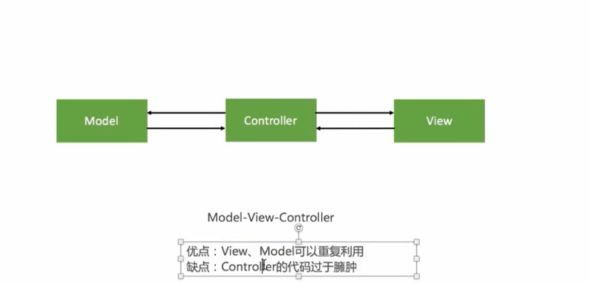
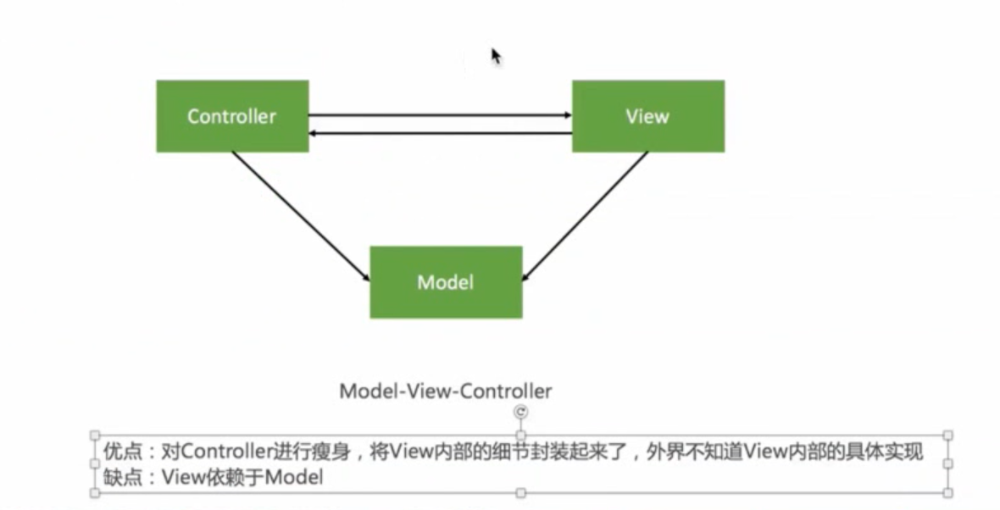

# 架构设计  
## 架构 
软件开发中的设计方案    

## MVC  

  

## MVVM 
ViewModel: 实现了View 和Model 的动态绑定，当model 更改时， view实时进行更改  

## MVP  
类似 MVC 模式，将其中部分代码抽取到 P 层， 但Controller 还是可能会存在   

[连接](https://github.com/skyming/Trip-to-iOS-Design-Patterns)  

