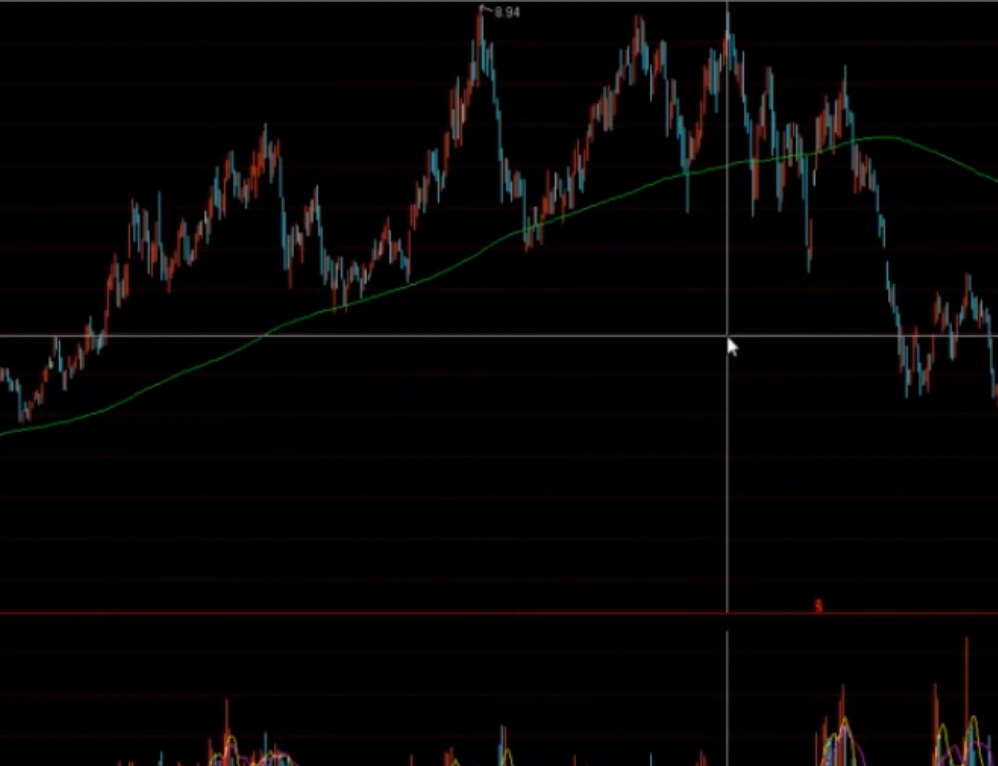
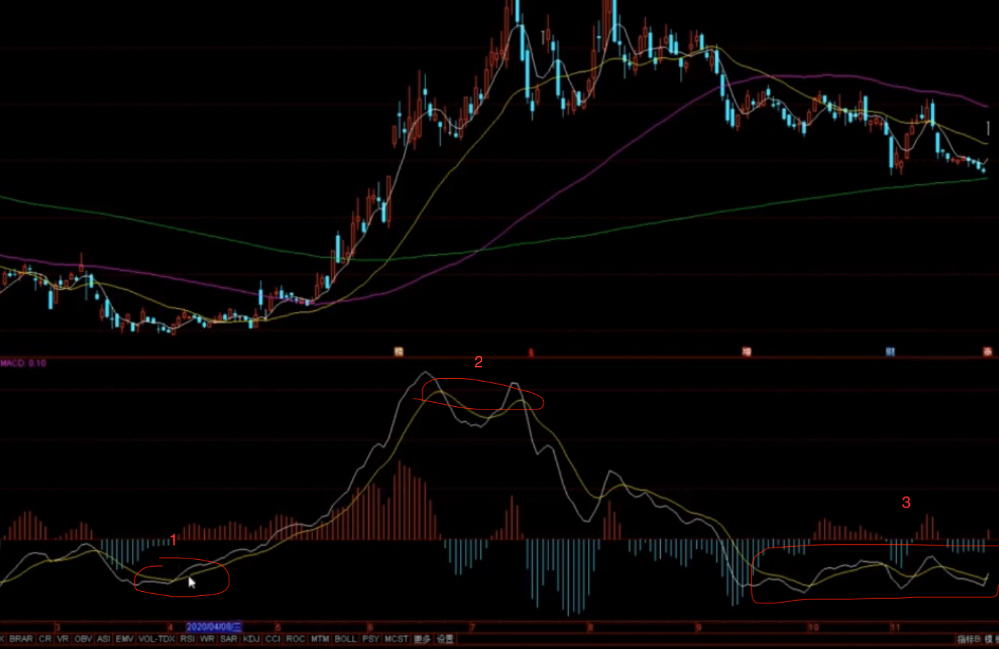

# 定位法 

## 1. 趋势(均线的作用)
目前处于什么趋势？ 📈趋势？ 📉趋势？ 
 
1. 📈趋势(均线多头排列)

2. 📉趋势(开始空头排列)
    
3. 震荡趋势(k 线围绕均线上下波动)
    均线杂乱无章，k线也是上下无序波动震荡，所有的均线对k线没有压制作用也没有支撑作用。 

### 优点
1. 有效性特别强(__📈：逢低买入，📉：逢高卖出__)
    只要形成，就说明后续一段时间内都是此趋势执行📈或📉

### 缺点
1. 滞后性(__解决方案：  结合k线__) 
    无法做在趋势的起始最低点， 也无法逃离在趋势的末端
    

### 趋势转变的特点 
1. 📈趋势-----> 📉趋势
    * 震荡， 冲高力度不够，无法冲过前高～～～

2. 📉趋势 -----> 📈趋势
    * 一般📉趋势不会直接转换为📈趋势， 都是会震荡很久，然后才会慢慢的震荡上行～～～

### 总结 
1. __如果目前处于📉趋势，逻辑再好，也是尽量不参与的， 纵然它会📈一部分，但总体还是📉的～～__
2. __趋势的转变是需要k线的演变经历的__

## 2.  位置(参考历史走势)

已知目前的趋势的情况下， 股票的价格是处于什么样的位置，趋势的中段？ 末段？还是初始阶段？ 

### 相对位置
1. 相对低位？ 
2. 相对高位？ 
3. 相对中间位置？ 

## 3.  形态(k线结构)
微观形态。 k 线具体分析～～～

### 过去形态
1. 整理形态
    * 三角形 
    * 矩形 
    * 旗形
    * V 型

2. 顶底形态
    * w 顶底
    * 圆弧顶底 
    * v 型
 

## 4. 综合判定

在判断趋势(宏观),以及 k 线(微观)的前提下，综合考虑，根据自身的具体情况

1. 首先根据自身的操作习惯及情况，考虑多大的止损是可以接受的， 在那里止损是证明当前判断是错误的等
2. 盈利相关， 多少的收益是预期的。
3. 所有的出发点都是 买点， __如何确定在这里买？ 买的逻辑是什么？__

-----------------------------------------
## MACD

1. 滞后性
    金叉买， 死叉考虑卖出。 但是需要考虑滞后性

2. 有趋势性   
3. 经常反复有失效性(__震荡阶段， 此时不要再根据macd 去判断走势了__)
4. 有背离性(__准确性较高，不常见，需要慎重__)

### 示例

  
1. 金叉。 此处可以观察此股， 如果趋势为上升趋势，就可以买入  
    在此阶段，可以考虑回调买入  

2. 死叉。 此时应该考虑卖出了，若干趋势变为向下趋势，就可以赶紧卖出了。

3. 此处macd 已经变为 __反复__, 此时， macd 已经失去参考性了， 此股也就不需要再考虑了
