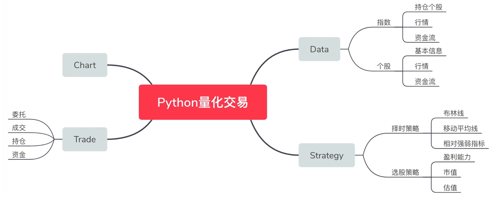

# 量化交易 

## 概览
1. 量化科普
2. 获取股票数据
3. 计算交易指标 
4. 设计交易策略：择时策略 
5. 设计交易策略：选股策略 
6. 数据回测与优化
7. 实现股票实盘交易   

### 常用python库 
1. Zipline 
2. EasyTrader  

### 量化策略与指标  
均线(择时策略) 
盈利能力(选股策略)
周期性(板块轮动策略)

#### 1. 基本面 
1. 居民消费指数 
2. 人均国内生产总值 
3. 净资产收益率(ROE)  

#### 2. 技术面 
1. 股票收盘价 
2. k线 
3. 均线 

### 量化系统 

### 总结 
1. 量化交易 
    针对可交易的投资商品， 理性的运用逻辑分析和归纳统计判断市场趋势 
    策略： 基本面， 技术面 
2. 常用的量化指标 
    * 技术指标 
        
    * 基本面 
        * 财务数据 
        * 行业景气度 
        * 宏观经济 
        * 舆情数据

-------------------------------------------------------
# 数据获取  
## joinquant  

 ## 量化交易系统
    

## 估值方法 
1. 绝对估值法
    现金流折现模型  

2. 相对估值法
    pe/pb/ps 
    

## 总结 
1. 财务报表
    资产负债表、利润表、现金流表
2. 估值
    绝对估值(现金流折现模型)  
    相对估值(pe,pb, ps)  
     

--------------------------------------------------------
## 计算交易指标  

### 计算持仓收益 
 总盈亏  =  (市价 - 成本价) * 股数  
浮动盈亏比 = (市价 - 成本价) /   成本价  
成本价 =  买入金额 / 持有股数  

   

