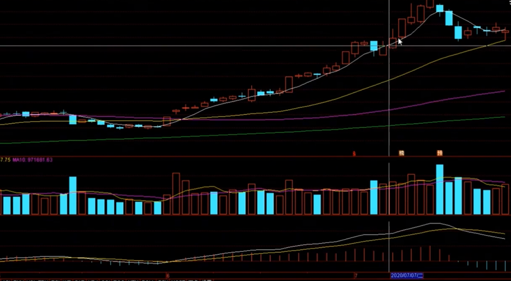
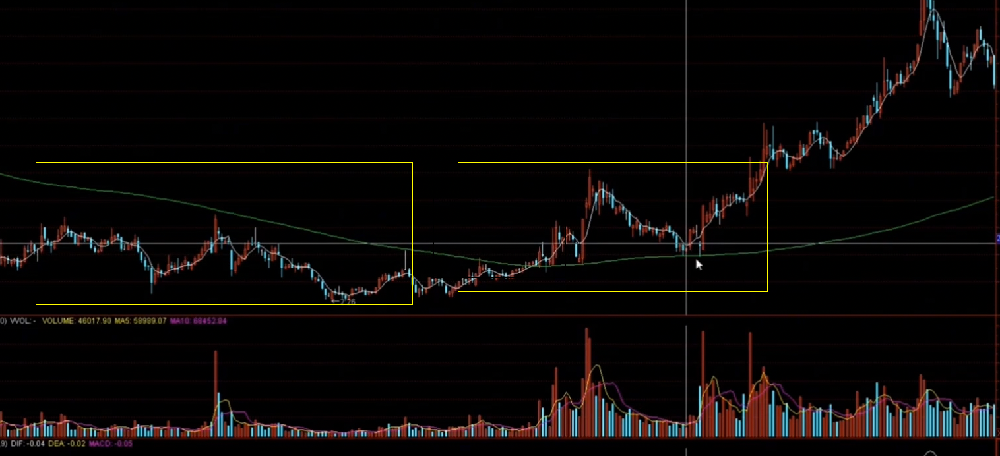
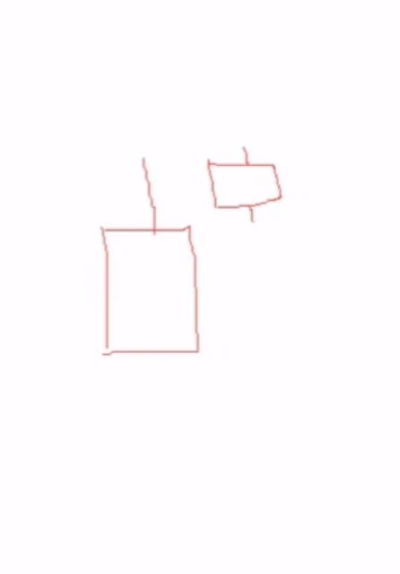
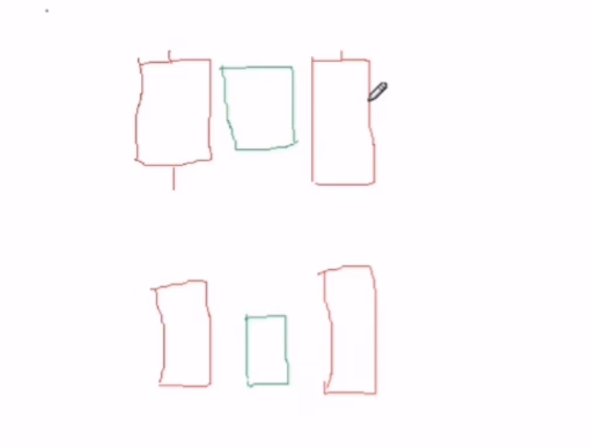

# 趋势战法  


## 注意： 回调不能是暴跌下来的  ！！！ ！！！！  


## 操作失败的几点原因  

1. 没有原则， 没有固定的模式(__需要有一套自己的固定模式和操作原则__)  
2. 没有定位好的买点  
3. 心态跟随市场情绪化  
4. 纠结的心态  
5. 人云亦云， 没有自己独立的判断


#### 1. 什么是上涨趋势？ 特点是什么？ 
__易涨难跌__, 因为在下跌的时候有很多的支撑  

#### 2. 怎么区分是上涨趋势还是下跌趋势？ 
__均线系统__, 如果均线系统的角度是往上的， 那么一般就是上涨趋势  

__下跌趋势的不能碰！！ 不能碰！！！ 不能碰！！！__


## 均线系统的应用  
> 如果一个股票长时间维持在一个价格，但是突然某一天涨破这个价格，说明这个股价格突然变强势了； 如果突然跌破这个价格，说明变弱势了，需要⚠️了： __是什么造成它突然跌破这长时间的一个平均价格. 说明价格变弱了，有一定的再次📉的概率__     


#### 1. 均线的由来及生成方式 
是由每天的收盘价，加权求平均值，生成点，然后将所有的点连接到一起-----> 平均线


#### 2. 平均线的应用  
* 股价 >>> 5日移动平均线： 说明，股价在 5日内都是强势的  
* 股价 >>> 10日移动平均线： 说明，股价在 10日内都是强势的
* 股价 >>> 30日移动平均线： 说明，股价在 30日内都是强势的


* __股价 >>> 5日 && >>> 10 日 && >>> 30 日移动平均线： 说明，股价处于一个强势状态__


* 股价 >>> 30 日移动平均线 && <<< 10日移动平均线， 说明，股价短期来看，已经处于弱势了； 但从长期来看，还是处于一个强势的状态。 __这种情况就需要多多观察，看后续 30 日线是否有支撑。谨慎起见，这里其实可以考虑合适点位卖出了__     


__这就是移动平均线对股价的支撑/压制作用__   


#### 3. 震荡趋势  
__如果股价在均线之上进行上下震荡， 均线对股价形成不了支撑/压制作用的。 --------震荡趋势__   


------------------------------------------------------  
## 趋势选股  
1. 股价必须站在 200 日🧵之上  
2. 中短期以 5 ， 20 日线为基础，必须站在这些之上


------------------------------------------------------
## 分时图类型  

1. 单边上涨(重点关注)    
    __开盘就上涨__  
2. 单边下跌  
    __低开，或者平开，就单边下跌__   
3. 开盘强转弱  
    __开盘时上涨的， 然后就被打回来，横盘横不住， 就进行下跌__

4. 开盘弱转强(重点关注)  
    __开盘是向下的，但马上又横盘，并且慢慢的转强上来, 甚至超过了开盘价__  
5. 震荡  
    __开盘后上涨几个点，然后又转跌几个点，然后再次上涨几个点，又再次下跌几个点，往返复复


## 趋势战法模式------均线回踩模式  
1. 从大的方向筛选-----通过趋势选股法，选出合适的股票  
2. 从均线回调支撑判断-----判断当前过票是否在均线回调到合适的位置， 例如： 有些是回调到24日线，有些是72日线等等，就是回调到支撑位置的均线    
3. 利用分时图来进行买点判断------- 根据分时图，判断当日的大体情况，然后进行合适买点切入   

### 重点： 
__1. 如果买入后， 大概 3 天， 还没有📈，就需要考虑出掉了__  
__2. 注意观察大盘风险，如果有风险的时候，就不要做__   
__3. 止损点设置， 一般设置固定的  3 个点， 只要亏 3个点， 就要出,只有保证账号不会大幅亏损才能盈利__
__4. 选择股票上， 不要将就， 如果股票的形态非常杂乱，就一定不能入__


## 趋势战法模式-----强势趋势战法  
  

1. 这种强趋势的票，在大的📈后，也会进行小的回调，等等均线  
2. 这种票不要买在 大阳线 上  
3. 注意： 这种票出现大阳线之后，如果没有📈， 就需要注意，它可能在回调， 回调到 5 日🧵，就进行买入(前提是这种大强势，以5日线为支撑的票)  
4. 注意： 这里的前提是， 5 日线不能走平， 不能跌破 5日线(可以当日跌破后马上又涨上来的)。 如果接下来几天在 5 日线上下波动的， 这种5日线就没用了。 需要演变思虑， 这种票就需要回踩了，需要往 10 日，20 日线看了    

5. 如果第一天是个 大阳线， 第二天低开  
    考虑， 这种试探性的下跌后， 受到承接，跌不下去，那么就可能会上涨， 此时可以考虑买入  
6. 如果第一天是个大阳线， 第二天高开  
    考虑，这种情况下，前天获利的人就有可能会走掉， 


## 趋势战法模式-----反转趋势  
  

1. 第一个框： 此处处于下跌趋势，🧵方向还是向下的  
2. 此处🧵被穿过，并且两次跌到附近有一定的支撑，没有被跌破，并且，🧵的形式相对平缓，所以形成趋势反转   
3. 关于均线选择： 在趋势过程中， 需要考虑那个均线对股价的支撑/压制作用明显，就以那个为参照   


## 趋势战法模式 ----- 技术加业绩模式(中短线--一周到月的)
#### 为啥买的业绩不错的股，但是它就是不涨？ 
需要从以下两方面进行考虑：  
* 宏观  
    题材， 热点， 业绩如何
* 微观  
    当前处于什么位置，结构是怎么样的， 上方的套牢筹码多不多，刚起涨？还是涨了有一段时间了等  

#### 业绩好 + 趋势好


### 选股 
1. 条件选股  
    1. 均线多头排列 
    2. 计算参数：  5 ， 6， 72， 200
    选出符合趋势的股  
2. 定制选股  
    * 净资产收益率： 代表公司的盈利能力
    * 板块选择 趋势选股结果创建的那个自定义板块    


----------------------------------- 
# 总结 
1. 选股模式 
2. 根据不同的股票总铺师定模式  
3. 加入自选观察耐心等待买点  
4. 阴线不买，预期阳线买  
    * 走出阴线，第二天走阳线还是阴线是难以预料的。 __需要根据第二天开盘后的分时图来分析，是走强势还是走弱转强， 这种就是一个阳线。 分时图是强势的再去买，起码增大了它是阳线的概率__
5. 买入后出场机会  
    __放平心态，卖出后大涨也和自己没关系__  
    * 股票的两种盈利模式  
        * 赢在胜率上。 例如： 做10次，有6次是盈利的，4次是亏损的，那么最后算账还是盈利的  
        * 盈亏比要大。 例如： 亏一次亏3个点，但是赚一次赚 10 个点。 __这种犯错的概率要高__

6. 盘尾票模式建议  
    *  模式1   
         
        以上的k线模式
        * 第一天： 阳线，但是有个上影线。 如果第二天收盘的时候，阳线，并且站在了前一天的 收盘价之上。 那么 __尾盘可以买入__   
    * 模式2  
          
        第一天放量上涨  
        第二天 缩量下跌 (这个就是所谓的假阴线)  
        第三天 又是一根阳线直接起来的  
        __尾盘买入__  


---------------------------------------
## 公式选股后----剔除非目标股  

1. 趋势选股(公式)  
    20， 24， 72， 120 (这个根据实际情况看那个🧵支撑更强)  
    __不能是暴跌的__   
2. 换手率  
    缓慢回调的一半换手率都不会太高。(换手率高： 要不是振幅大，要不是📈/📉的多) __太高的剔除__    
3. 涨幅 
    今天选，明天能📈的票。 那么今天的涨幅不能太大 (__5个点之上的剔除__)  

4. 三日涨幅  
    三日涨幅不能太大，太大就有追高的嫌疑(__三日涨幅超过 10 剔除__)   

善于总结
    可以考虑其他条件，比如 振幅 等  


__通达信__  
修改公式. 复制的是系统自带的多头选股

```
CLOSE > A3 AND A1>A2 AND A2> A3 AND A3>A4  
```


