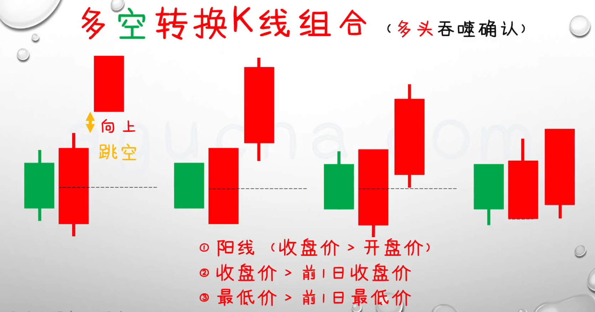

# K 线  

 ## k 线构成 
  
 __顶部为最高价， 底部为最低价__  

 ### 关键字 英文简称 
 * 最低价 (__L__)  
 * 最高价 (__H__)  
 * 开盘价 (__O__)  
 * 收盘价 (__C__)  

### 阳线 
  

### 阴线  

 

# K 线组合

## 多空转换 k 线组合  
  

### 下跌趋势反转  
当创新低后， 第二日 __低开__ , 并且收的是大阳线，__放量的__, __后市大概率是上涨的__

#### 条件  
1. 股价连续下跌，创阶段新低  
2. 阳线实体包住前一日 __阴线__  
3. 阳线 __成交量明显放大__

#### 买入点 
次日确认， 突破后买入

### 上涨趋势反转  
当创新高后， 开盘 __高开__, 并且收的是 大阴线， __后市大概率是下跌的__

#### 条件 
1. 股价连续上涨， __创阶段新高__  
2. 阴线实体包住前一日 __阳线__  
3. 阴线 __成交量无明显缩量__

#### 卖出点 
当天收盘时， 就可以减仓操作， 第二天确认后， 就可清仓  

## 母子线  
母子线由两条 k 线组成  
1. 第一条k 线 大阴线 或 大阳线，， 第二条k 线 阴、阳均可  
2. 长实体， 最好包住 第二条k 线的全部  

### 多头母子(阴孕阳) 
__下跌趋势反转组合__   

### 止损点 
前一日的阴线最低位  

### 空头母子(阳孕阴) 
__上涨趋势反转组合__  

### 止盈点 
前一日的阳线最低位  

## 锤子线 、 上吊线  
1. 发生在 __加速急跌__ 或 __加速急涨__ 阶段
    * 加速急跌 ------ 锤子线 
    * 加速急涨 ------ 吊人线  

2. k 线阴阳线均可， k线 __实体长度 < 下引线长度__  
3. 最好该 k 线 无上影线， 且  下引线长度是实体 1.3 倍以上。   

### 急跌趋势反转 k 线  --- 后市大概率上涨

### 急涨趋势反转k 线 ---- 后市大概率下跌

## 启明星、 黄昏星  
  
